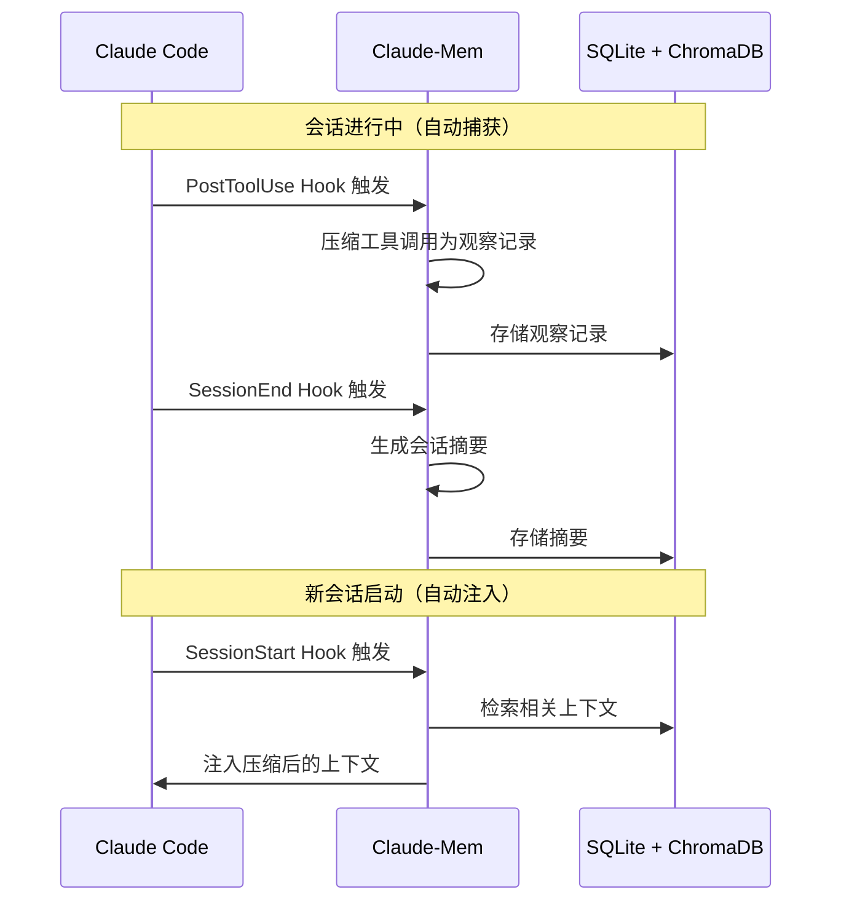

:::info {title="📊 页面导航"}
**适用角色与上手难度**

| 角色 | 推荐度 | 上手难度 |
|------|--------|----------|
| 🛠️ 开发 | ★★★★★ | ★★★☆☆ |
| 🧪 测试 | ★★★☆☆ | ★★★☆☆ |
| 📦 产品 | ★★★☆☆ | ★★★☆☆ |

**🎯 学习产出：** 掌握持久化记忆功能，能独立为 Claude Code 配置跨会话的自动化记忆系统

**🚀 AI 能力提升：** 上下文管理
:::

# Claude-Mem 持久记忆

[Claude-Mem](https://github.com/thedotmack/claude-mem) 是一个开源的持久记忆压缩系统，为 Claude Code 提供**跨会话的上下文记忆**。它自动捕获会话中的工具使用观察，生成语义摘要，并在未来会话中注入相关上下文——让 Claude 在项目上保持知识的连续性。

## 为什么需要持久记忆

Claude Code 的记忆机制有两个局限：

- **CLAUDE.md 是静态的**：需要手动维护，不会自动学习项目经验
- **内置 Memory 是会话级的**：虽然跨会话持久化，但需要用户主动触发"记住"，且以文本片段形式存储，缺乏语义检索能力

这意味着每次新会话，Claude 都会**遗忘**上一次会话中发现的问题、做出的决策和积累的经验。对于长期项目，这种"失忆"会导致：

- **重复探索**：每次都要重新理解代码结构和架构决策
- **遗忘 Bug 上下文**：上次调试发现的根因、workaround、失败的尝试
- **丢失设计决策**：为什么选择方案 A 而不是方案 B，背后的权衡是什么
- **无法积累项目知识**：每次会话都是从零开始

Claude-Mem 通过自动化的记忆管道解决这些问题——**无需手动干预**，它在后台静默工作。

## 架构

```text
Claude Code ──Hooks──▶ Claude-Mem Worker ──AI 压缩──▶ SQLite + ChromaDB
     │                     │                              │
     │              HTTP API (port 37777)           持久化存储
     │                     │                              │
     └── MCP 工具 ◀── mem-search Skill ◀── 语义检索 ◀──┘
```

Claude-Mem 由六个核心组件构成：

1. **5 个生命周期 Hooks** — SessionStart、UserPromptSubmit、PostToolUse、Stop、SessionEnd（6 个 Hook 脚本）
2. **Smart Install** — 缓存依赖检查器（pre-hook 脚本）
3. **Worker Service** — HTTP API（端口 37777），含 Web Viewer UI 和 10 个搜索端点，由 Bun 管理
4. **SQLite 数据库** — 存储会话、观察记录、摘要
5. **mem-search Skill** — 自然语言查询，支持渐进式披露
6. **ChromaDB 向量数据库** — 混合语义 + 关键字搜索，实现智能上下文检索

### 工作流程



## 安装

### 系统要求

- **Node.js**：18.0.0 或更高
- **Claude Code**：最新版本，支持插件
- **Bun**：JavaScript 运行时和进程管理器（缺失时自动安装）
- **uv**：Python 包管理器，用于向量搜索（缺失时自动安装）
- **SQLite 3**：持久化存储（内置）

### 方式一：npx 安装（推荐）

```bash
npx claude-mem install
```

### 方式二：通过插件市场

在 Claude Code 中执行：

```
> /plugin marketplace add thedotmack/claude-mem
> /plugin install claude-mem
```

### 方式三：Gemini CLI

```bash
npx claude-mem install --ide gemini-cli
```

### 方式四：OpenCode

```bash
npx claude-mem install --ide opencode
```

安装后重启 Claude Code，之前会话的上下文将自动出现在新会话中。

:::warning
`npm install -g claude-mem` 安装的仅是 SDK/库，**不会**注册插件 Hooks 或启动 Worker 服务。始终使用 `npx claude-mem install` 或 `/plugin` 命令安装。
:::

### Windows 注意事项

如果遇到以下错误：

```powershell
npm : The term 'npm' is not recognized as the name of a cmdlet
```

确保 Node.js 和 npm 已安装并添加到 PATH。从 https://nodejs.org 下载最新安装程序，安装后重启终端。

## MCP 搜索工具

Claude-Mem 提供 4 个 MCP 工具，遵循高效的**三层工作流**模式：

### 三层工作流

| 层级 | 工具               | 用途                           | Token 成本           |
| ---- | ------------------ | ------------------------------ | -------------------- |
| 1    | `search`           | 获取紧凑索引（含 ID）          | ~50-100 tokens/条    |
| 2    | `timeline`         | 查看特定观察周围的时间线上下文 | 中等                 |
| 3    | `get_observations` | 按 ID 获取完整详情             | ~500-1,000 tokens/条 |

**核心原则**：先用 `search` 浏览索引，用 `timeline` 确认上下文，最后只对相关 ID 调用 `get_observations` 获取详情——实现约 **10 倍 Token 节省**。

### 使用示例

```
> 搜索一下之前关于认证模块的调试记录
```

Claude-Mem 会通过 MCP 工具自动完成三层检索：

```typescript
// 第 1 步：搜索索引
search((query = 'authentication bug'), (type = 'bugfix'), (limit = 10));

// 第 2 步：查看上下文
timeline((observation_id = 123));

// 第 3 步：获取详情
get_observations((ids = [123, 456]));
```

### 搜索过滤

`search` 工具支持多种过滤条件：

| 过滤参数  | 说明         | 示例                                 |
| --------- | ------------ | ------------------------------------ |
| `query`   | 自然语言查询 | `"数据库迁移失败"`                   |
| `type`    | 观察类型     | `bugfix`、`decision`、`architecture` |
| `date`    | 时间范围     | `last-7-days`                        |
| `project` | 项目名称     | `my-saas-app`                        |

## Web Viewer UI

Claude-Mem 内置 Web 界面，提供实时记忆流查看：

```
http://localhost:37777
```

功能包括：

- **实时观察流**：查看 Claude-Mem 捕获的每一条观察记录
- **搜索界面**：浏览和搜索所有存储的记忆
- **引用链接**：通过 ID 查看特定观察记录（`http://localhost:37777/api/observation/{id}`）
- **设置管理**：切换稳定版和 Beta 版，配置模式和语言
- **统计概览**：查看存储的会话数、观察记录数、摘要数

## 配置

### 基础配置

配置文件位于 `~/.claude-mem/settings.json`，首次运行时自动创建：

```json title="~/.claude-mem/settings.json"
{
  "CLAUDE_MEM_MODE": "code"
}
```

完整配置项包括 AI 模型、Worker 端口、数据目录、日志级别和上下文注入设置，详见 [配置指南](https://docs.claude-mem.ai/configuration)。

### 模式与语言

Claude-Mem 支持多语言模式，控制生成的观察记录语言：

| 模式       | 说明         |
| ---------- | ------------ |
| `code`     | 默认英文模式 |
| `code--zh` | 简体中文模式 |
| `code--ja` | 日语模式     |

语言模式遵循 `code--[lang]` 格式，其中 `[lang]` 是 ISO 639-1 语言代码。中文模式 `code--zh` 已内置，无需额外安装。

```json title="~/.claude-mem/settings.json"
{
  "CLAUDE_MEM_MODE": "code--zh"
}
```

修改后重启 Claude Code 生效。

### 隐私控制

使用 `<private>` 标签包裹敏感内容，Claude-Mem 会将其排除在存储之外：

```
> 这是我的数据库密码：<private>my-secret-password</private>
> 帮我配置连接
```

## Beta 功能

Claude-Mem 提供 Beta 频道的实验性功能，包括：

- **Endless Mode**（仿生记忆架构）：专为长时间会话设计，自动管理上下文窗口
- 通过 Web Viewer（`http://localhost:37777` → Settings）在稳定版和 Beta 版之间切换

详见 [Beta 功能文档](https://docs.claude-mem.ai/beta-features)。

## 使用场景

### 场景一：跨会话调试

```
会话 1：
> 用户登录偶尔失败，帮我排查
→ Claude-Mem 自动记录调试过程、根因（JWT 过期时间不同步）、修复方案

会话 2（几天后）：
> 用户反馈登录又出问题了
→ Claude-Mem 自动注入上次的调试记录，Claude 直接从已知上下文出发，无需重新排查
```

### 场景二：架构决策追溯

```
会话 1：
> 我们要选择 REST 还是 GraphQL？
→ Claude-Mem 记录决策过程和最终选择 REST 的原因（团队熟悉度、缓存简单性）

会话 3（一个月后）：
> 有人提议改用 GraphQL，你觉得呢？
→ Claude-Mem 注入当时的决策记录，Claude 可以基于历史权衡给出建议
```

### 场景三：项目知识积累

```
会话 1：
> 这个项目的认证流程是怎样的？
→ Claude-Mem 记录完整的认证链路分析

会话 5（新功能开发）：
> 在认证模块添加 OAuth 支持
→ Claude-Mem 注入认证流程分析，Claude 直接在正确的位置添加代码
```

## 与其他工具的关系

| 方面         | Claude-Mem                   | [CLAUDE.md](/guide/intermediate/claude-md) | [Claude Code Memory](/guide/intermediate/context-management#记忆系统) | [Serena 内存](/guide/advanced/serena#内存管理) |
| ------------ | ---------------------------- | ------------------------------------------ | --------------------------------------------------------------------- | ---------------------------------------------- |
| **定位**     | 自动化持久记忆               | 静态项目约定                               | 手动记忆片段                                                          | 代码级符号知识                                 |
| **自动化**   | ✅ 全自动                    | ❌ 手动维护                                | ❌ 需用户触发                                                         | 部分自动                                       |
| **跨会话**   | ✅                           | ✅                                         | ✅                                                                    | ✅                                             |
| **语义检索** | ✅ 向量 + 全文               | ❌                                         | ❌                                                                    | ❌                                             |
| **存储位置** | SQLite + ChromaDB            | 项目仓库                                   | `~/.claude/projects/`                                                 | `.serena/`                                     |
| **适用信息** | 会话观察、调试记录、决策历史 | 项目约定、命令、规范                       | 用户偏好、反馈                                                        | 代码符号、调用关系                             |

:::info
**互补而非替代：** Claude-Mem 与 CLAUDE.md、内置 Memory、Serena 内存各司其职。CLAUDE.md 记录"规则"，内置 Memory 记录"偏好"，Serena 记录"代码结构"，Claude-Mem 记录"经验"——四者可以同时使用。
:::

## 卸载

```bash
# 方式一：通过 npx
npx claude-mem uninstall

# 方式二：通过插件市场
> /plugin uninstall claude-mem
```

## 相关资源

- [Claude-Mem GitHub](https://github.com/thedotmack/claude-mem) — 项目仓库
- [Claude-Mem 文档](https://docs.claude-mem.ai/) — 完整使用指南
- [Claude-Mem 官网](https://claude-mem.ai/) — 项目主页
- [Claude-Mem Discord](https://discord.com/invite/J4wttp9vDu) — 社区支持
- [@Claude_Memory](https://x.com/Claude_Memory) — 官方 X 账号

## 下一步

- [Claude-Mem 技能概览](/skills/docs-context/claude-mem) — MCP 工具速查和安装命令
- [上下文管理](/guide/intermediate/context-management) — 管理对话上下文和记忆
- [CLAUDE.md 与项目约定](/guide/intermediate/claude-md) — 静态项目配置
- [MCP 服务器](/guide/advanced/mcp-servers) — 了解 MCP 服务器配置
- [Hooks](/guide/advanced/hooks) — 了解生命周期钩子机制
- [技巧与最佳实践](/tips/best-practices) — 更多高效使用技巧
