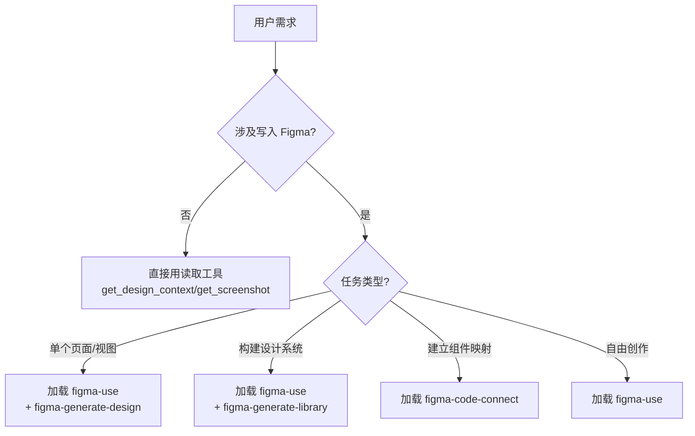
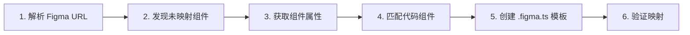

:::info {title="📊 页面导航"}
**适用角色与上手难度**

| 角色 | 推荐度 | 上手难度 |
|------|--------|----------|
| 🛠️ 开发 | ★★★★★ | ★★★☆☆ |
| 🧪 测试 | ★★☆☆☆ | ★★★★☆ |
| 📦 产品 | ★★★★☆ | ★★★☆☆ |

**🎯 学习产出：** 掌握 Figma MCP 集成，能实现设计稿到代码的自动转换

**🚀 AI 能力提升：** 设计→代码、技能扩展
:::

# Figma MCP

Figma MCP 是 Figma 官方提供的 MCP 服务器，通过 Figma API 和 Plugin API 连接 Figma 文件，让 Claude Code 可以直接**读取设计稿生成代码**、**将代码页面推入 Figma**、**建立组件映射**，以及**构建设计系统**。

## 概述

Figma MCP 解决了前端开发中设计与代码脱节的几个核心问题：

- **设计→代码**：从 Figma 设计稿获取设计上下文（样式、布局、资源），直接生成前端组件代码
- **代码→设计**：将运行的页面或组件推入 Figma，生成像素级设计稿，保持设计与实现同步
- **组件映射**：通过 Code Connect 建立 Figma 组件与代码组件的双向链接
- **设计系统构建**：从代码中提取 Token、组件，在 Figma 中构建完整的设计系统

## 安装配置

### 安装插件

在 Claude Code 中安装 Figma 插件：

```bash
/plugin install figma
```

安装完成后重新加载插件：

```bash
/reload-plugins
```

### Figma 认证

安装后需要连接 Figma 账号：

```bash
/plugin
```

选择 Figma 并完成 OAuth 认证。认证成功后，Figma MCP 工具即可使用。

### 验证安装

用 `whoami` 确认认证状态：

```
> 查看 Figma 认证状态
```

Claude Code 会调用 `whoami` 工具，返回当前登录的 Figma 用户信息。

### 权限配置

建议在 `.claude/settings.local.json` 中允许 Figma MCP 的工具权限，减少重复授权提示：

```json
{
  "permissions": {
    "allow": [
      "mcp__plugin_figma_figma__get_design_context",
      "mcp__plugin_figma_figma__get_screenshot",
      "mcp__plugin_figma_figma__get_metadata",
      "mcp__plugin_figma_figma__use_figma",
      "mcp__plugin_figma_figma__search_design_system"
    ]
  }
}
```

## 工具全景

Figma MCP 提供 20+ 个工具，按用途分为四类：

### 读取类（从 Figma 获取信息）

| 工具 | 用途 | 典型场景 |
|------|------|----------|
| `get_design_context` | 获取节点的设计上下文（含参考代码、截图、元数据） | **设计→代码的主入口** |
| `get_screenshot` | 生成节点的截图 PNG | 查看设计稿外观、视觉验证 |
| `get_metadata` | 获取节点/页面的 XML 结构（ID、类型、位置、尺寸） | 了解文件结构、检查层级 |
| `get_variable_defs` | 获取节点的设计变量定义 | 提取颜色、间距等设计 Token |

### 写入类（向 Figma 写入/修改）

| 工具 | 用途 | 典型场景 |
|------|------|----------|
| `use_figma` | **核心写入工具** — 执行 Figma Plugin API JavaScript 代码 | 创建/编辑节点、设置变量、构建组件 |
| `generate_figma_design` | 捕获网页并导入 Figma（需要 fileKey） | 将运行的页面推入 Figma |
| `create_new_file` | 创建新的 Figma 设计文件 | 从零开始构建设计系统 |
| `upload_assets` | 上传图片到 Figma 文件 | 导入图标、位图资源 |

### 设计系统类

| 工具 | 用途 | 典型场景 |
|------|------|----------|
| `search_design_system` | 搜索已发布的设计系统中的组件、变量、样式 | 发现可复用的设计资产 |
| `get_libraries` | 获取文件可用的组件库列表 | 了解有哪些库可用 |
| `download_assets` | 下载节点的导出资源和原始图片 | 获取图标、位图等资产 |

### Code Connect 类（组件映射）

| 工具 | 用途 | 典型场景 |
|------|------|----------|
| `get_code_connect_map` | 获取已建立的 Code Connect 映射 | 查看现有组件映射 |
| `get_code_connect_suggestions` | 获取 AI 建议的组件映射方案 | 发现未映射的组件 |
| `add_code_connect_map` | 添加单个 Code Connect 映射 | 手动建立简单映射 |
| `send_code_connect_mappings` | 批量保存多个映射 | 批量建好映射后统一保存 |

:::tip 工具调用顺序
**读操作优先于写操作**。在修改 Figma 文件之前，先用 `get_metadata` 或 `get_design_context` 了解现有结构。对于写入操作，遵循增量构建原则——每次 `use_figma` 调用只做 5–10 个逻辑操作，验证后再继续。
:::

## 技能体系

Figma MCP 提供了 4 个结构化技能（Skills），它们封装了常见工作流的完整步骤。**技能之间是互补关系，而非替代关系**：

| 技能 | 角色 | 触发时机 |
|------|------|----------|
| **figma-use** | Plugin API 语法规则和最佳实践 | **每次 `use_figma` 调用前必须加载** |
| **figma-generate-design** | 从代码构建页面/视图到 Figma | 将页面、弹窗、侧边栏等推入 Figma 时 |
| **figma-generate-library** | 从代码构建完整设计系统 | 创建变量、组件库、主题时 |
| **figma-code-connect** | 建立组件映射和 .figma.ts 模板 | 映射 Figma 组件到代码组件时 |

### 技能的调用关系



**每次使用 `use_figma` 写 Figma 时，必现先加载 `figma-use` 技能**，因为它包含了 Plugin API 的关键规则：颜色范围（0–1 而非 0–255）、字体加载要求、Page 切换方式、HUG/FILL 限制等。跳过它会直接导致代码执行失败。

## 设计→代码（读取 Figma 生成前端组件）

这是最常用的工作流：从设计师提供的 Figma URL 中提取设计信息，直接生成前端组件代码。

### 核心工具：get_design_context

`get_design_context` 是设计→代码的主入口。给定一个 Figma 节点 URL，它会返回：

1. **参考代码** — 基于节点结构生成的 HTML/CSS 或 React 代码片段
2. **截图** — 节点渲染后的外观
3. **元数据** — 节点的样式信息（颜色、字体、间距等）
4. **资源 URL** — 节点中引用的图片等资产的下载链接

### 完整示例：从设计稿实现 Card 组件

假设设计师给了一个 Card 组件的 Figma 链接：

```
https://figma.com/design/ABC123/DesignSystem?node-id=42-100
```

#### 步骤 1：获取设计上下文

```
> 从这个 Figma 节点获取设计上下文，生成 React + Tailwind CSS 代码
> https://figma.com/design/ABC123/DesignSystem?node-id=42-100
```

Claude Code 会自动解析 URL，提取 `fileKey=ABC123`、`nodeId=42:100`，调用 `get_design_context`。

返回的内容包含：

- 节点的样式分析（背景色、圆角、阴影、内边距）
- 子元素的布局方式（Auto Layout → Flexbox 映射）
- 文本内容和字体样式
- 颜色值和间距数值

#### 步骤 2：生成组件代码

结合设计上下文，Claude Code 会生成适配项目的组件代码。例如使用 React + Tailwind CSS：

```tsx
// components/ProductCard.tsx
interface ProductCardProps {
  image: string
  title: string
  price: number
  description: string
}

export function ProductCard({ image, title, price, description }: ProductCardProps) {
  return (
    <div className="rounded-xl bg-white shadow-sm border border-gray-100 overflow-hidden w-80">
      
      <div className="p-4 flex flex-col gap-2">
        <h3 className="text-lg font-semibold text-gray-900">{title}</h3>
        <p className="text-sm text-gray-500 line-clamp-2">{description}</p>
        <span className="text-xl font-bold text-blue-600">¥{price}</span>
      </div>
    </div>
  )
}
```

#### 步骤 3：提取和下载资源

如果需要原设计稿中的图片、图标等资源，使用 `download_assets`：

```
> 下载节点 42:100 中的所有图片和图标资源
```

Figma MCP 会返回可下载的 URL 列表，Claude Code 将其保存到项目的 `public/` 或 `assets/` 目录。

### 常用读取模式

#### 获取页面结构概览

用 `get_metadata` 快速了解 Figma 文件的页面和层级结构：

```
> 获取这个 Figma 文件的顶层页面结构
> https://figma.com/design/ABC123/DesignSystem
```

#### 获取设计变量（Design Tokens）

用 `get_variable_defs` 提取设计系统中定义的颜色、间距等 Token：

```
> 获取节点的设计变量定义
> https://figma.com/design/ABC123/DesignSystem?node-id=42-100
```

返回的变量可以直接映射为 CSS 变量或 Tailwind 配置。

#### 获取特定状态/变体的截图

用 `get_screenshot` 查看组件的不同状态（hover、active、disabled）：

```
> 截取节点 42:100 的截图
```

这对于理解组件的视觉细节（阴影层次、渐变效果）非常有用——文字描述很难传达这些细微的视觉差异。

### 设计→代码的局限性

| 能做 | 不能做 |
|------|--------|
| 提取布局结构 → Flexbox/Grid | 自动识别业务逻辑 |
| 提取颜色、字体、间距 | 理解组件的交互状态机 |
| 提取文本内容 | 自动适配响应式布局 |
| 下载图片和图标 | 直接输出像素级完美代码 |
| 获取设计变量/Token | 自动处理复杂动画 |

生成代码后，通常需要手动调整：响应式宽度、交互状态、无障碍属性（aria-label、role）。

## 代码→设计（将页面推入 Figma）

反向工作流：将开发好的前端页面或组件推入 Figma，保持设计与实现同步。

### 两种途径

| 途径 | 工具 | 适用场景 |
|------|------|----------|
| **A. 自动捕获** | `generate_figma_design` | 网页已运行在浏览器中，快速生成像素级截图 |
| **B. 手动构建** | `use_figma` + `figma-generate-design` | 需要组件实例和设计系统绑定，保持可编辑性 |

**最佳实践是并行使用两者**：

1. 用 `generate_figma_design` 捕获像素级页面截图作为参考
2. 同时用 `use_figma` 从设计系统组件实例构建页面
3. 对比两者，修正布局细节
4. 删除截图输出，保留组件实例版本

### 途径 A：generate_figma_design（自动捕获）

适合「快速将页面推入 Figma 看看效果」。需要页面可通过 URL 访问（本地 dev server 或线上地址）。

```
> 将 http://localhost:3000/products 页面推入 Figma
> 使用 fileKey: ABC123
```

`generate_figma_design` 会：

1. 启动浏览器访问目标页面
2. 截图并分析页面结构
3. 在 Figma 文件中创建对应的 Frame 和节点

:::warning
此工具需要 `fileKey`。如果还没有 Figma 文件，先用 `create_new_file` 创建一个：

```
> 创建一个新的 Figma 设计文件，名称为"产品页面同步"
```
:::

### 途径 B：use_figma 手动构建（组件实例）

适合「需要与设计系统保持链接」的场景。构建出的节点是设计系统组件实例，后续设计系统更新后可以自动同步。

这个工作流需要先加载 `figma-generate-design` 技能，然后按以下步骤执行：

#### 步骤 1：发现设计系统组件

```
> 搜索 DesignSystem 文件中的 Button、Card、Input 组件
```

使用 `search_design_system` 在已发布的设计系统中查找可用组件。

#### 步骤 2：发现设计变量

```
> 搜索颜色和间距相关的设计变量
```

#### 步骤 3：创建页面骨架

通过 `use_figma` 创建 Auto Layout 容器：

```js
// 这是在 use_figma 中执行的 Plugin API 代码
const page = figma.createAutoLayout('VERTICAL')
page.name = 'Product Listing'
page.resize(1440, 100)
page.primaryAxisAlignItems = 'CENTER'
page.counterAxisAlignItems = 'CENTER'

// 绑定设计变量（而非硬编码颜色）
page.setBoundVariable('paddingTop', spacingMd)
page.setBoundVariable('paddingBottom', spacingMd)

return { createdNodeIds: [page.id] }
```

#### 步骤 4：按区域构建内容

每个区域（Header、Hero、Product Grid、Footer）一个 `use_figma` 调用，逐步填充页面内容。每完成一个区域，用 `get_screenshot` 验证视觉效果。

### 并行工作流对比

| | generate_figma_design | use_figma 手动构建 |
|------|------|------|
| 速度 | 快（自动） | 慢（逐区域构建） |
| 像素精度 | 高（截图级） | 依赖代码实现 |
| 可编辑性 | 低（截图转节点） | 高（可编辑实例） |
| 设计系统绑定 | 无 | 有（可变/组件链接） |
| 适用阶段 | 早期快速参考 | 长期维护同步 |

## Code Connect（组件映射）

Code Connect 建立 Figma 设计系统组件与代码组件之间的双向映射。映射后：

- 在 Figma 中选中组件时，可以看到对应的代码实现
- Dev Mode 中显示代码组件的导入路径和使用方式
- 设计变更时可以追踪影响到的代码文件

### 工作流

Code Connect 的工作流分为六步：



#### 步骤 1：解析 Figma URL

从 Figma 链接中提取 `fileKey` 和 `nodeId`：

```
https://figma.com/design/QiEF6w56/DesignSystem?node-id=4185-3778
→ fileKey: QiEF6w56
→ nodeId: 4185:3778（注意：URL 中的 - 转为 :）
```

#### 步骤 2：发现未映射组件

使用 `get_code_connect_suggestions` 查找选定节点中哪些已发布的组件还没有 Code Connect：

```
> 查看这个节点中有哪些未映射的组件
```

#### 步骤 3：获取组件属性

对每个未映射组件，调用 `get_context_for_code_connect` 获取其属性定义：

- **TEXT** — 文本内容（标签、占位文字）
- **BOOLEAN** — 开关（显示/隐藏图标、禁用状态）
- **VARIANT** — 枚举选项（尺寸、样式、状态）
- **INSTANCE_SWAP** — 可替换的嵌套组件（图标等）

#### 步骤 4：匹配代码组件

在项目中搜索与 Figma 组件匹配的代码组件。检查 Props 接口是否与 Figma 属性对应。

#### 步骤 5：创建 .figma.ts 模板

在组件文件旁边创建 `.figma.ts` 映射文件。以 Button 组件为例：

```ts
// src/components/Button.figma.ts
// url=https://figma.com/design/ABC123/DesignSystem?node-id=42-100
// source=src/components/Button.tsx
// component=Button
import figma from 'figma'
const instance = figma.selectedInstance

const label = instance.getString('Label')
const variant = instance.getEnum('Variant', {
  'Primary': 'primary',
  'Secondary': 'secondary',
})
const size = instance.getEnum('Size', {
  'Small': 'sm',
  'Medium': 'md',
  'Large': 'lg',
})
const disabled = instance.getBoolean('Disabled')

export default {
  example: figma.code`
    <Button
      variant="${variant}"
      size="${size}"
      ${disabled ? 'disabled' : ''}
    >
      ${label}
    </Button>
  `,
  imports: ['import { Button } from "@/components/Button"'],
  id: 'button',
  metadata: { nestable: true }
}
```

`figma.code` 是 Code Connect 的标记模板字面量——它会将 Figma 属性值映射为实际的代码片段。

### Code Connect 的使用场景

| 场景 | 收益 |
|------|------|
| 设计→代码时 | Claude Code 知道用哪个代码组件实现设计 |
| 代码→设计时 | 知道代码组件在 Figma 中对应哪个设计组件 |
| Dev Mode | 开发者看到精确的组件导入路径和使用方式 |
| 设计变更 | 追踪哪些代码文件受设计变更影响 |

## 实战案例

### 案例 1：从设计稿实现登录页面

目标：从 Figma 设计稿提取登录页面的设计信息，用 React + Tailwind CSS 实现。

**步骤 1**：获取设计上下文。

```
> 从 Figma 节点 100:200 获取设计上下文
```

**步骤 2**：分析返回结果——设计稿包含：背景色 `#F9FAFB`、居中的白色卡片（`480px` 宽）、标题「欢迎回来」、邮箱输入框、密码输入框、「记住我」复选框、登录按钮、注册链接。

**步骤 3**：生成组件代码：

```tsx
// app/login/page.tsx
export default function LoginPage() {
  return (
    <div className="min-h-screen bg-gray-50 flex items-center justify-center p-4">
      <div className="w-full max-w-md bg-white rounded-2xl shadow-sm border border-gray-100 p-8">
        <h1 className="text-2xl font-bold text-gray-900 mb-8">欢迎回来</h1>

        <form className="flex flex-col gap-4">
          <div className="flex flex-col gap-1.5">
            <label className="text-sm font-medium text-gray-700">邮箱</label>
            <input
              type="email"
              placeholder="name@example.com"
              className="rounded-lg border border-gray-200 px-3 py-2.5 text-sm focus:border-blue-500 focus:ring-1 focus:ring-blue-500 outline-none"
            />
          </div>

          <div className="flex flex-col gap-1.5">
            <label className="text-sm font-medium text-gray-700">密码</label>
            <input
              type="password"
              placeholder="••••••••"
              className="rounded-lg border border-gray-200 px-3 py-2.5 text-sm focus:border-blue-500 focus:ring-1 focus:ring-blue-500 outline-none"
            />
          </div>

          <label className="flex items-center gap-2 text-sm text-gray-600">
            <input type="checkbox" className="rounded" />
            记住我
          </label>

          <button className="bg-blue-600 text-white rounded-lg py-2.5 font-medium hover:bg-blue-700 transition-colors mt-2">
            登录
          </button>
        </form>

        <p className="text-sm text-gray-500 text-center mt-6">
          还没有账号？<a href="/register" className="text-blue-600 hover:underline">立即注册</a>
        </p>
      </div>
    </div>
  )
}
```

**步骤 4**：用 `download_assets` 下载 Logo 等图片资源。

```
> 下载登录页面设计稿中的 Logo 图片
```

### 案例 2：将商品列表页同步到 Figma

目标：开发完的商品列表页推入 Figma，创建可编辑的设计稿。

**前提**：已有 Figma 文件（fileKey），如果还没有则用 `create_new_file` 创建。

**步骤 1**（并行）：同时启动自动捕获和手动构建。

```
> 同时做两件事：
> 1. 将 http://localhost:3000/products 捕获到 Figma 文件 ABC123
> 2. 在 Figma 文件 ABC123 中搜索并构建 ProductCard 页面
```

**步骤 2**：对比两个结果。

- 自动捕获版本——像素级精确，但节点不可编辑
- 手动构建版本——组件实例可编辑，但布局可能略有偏差

**步骤 3**：以自动捕获版本为参考，调整手动构建版本的间距、尺寸等细节。

**步骤 4**：删除自动捕获版本，保留手动构建版本作为最终产出。

## 最佳实践与常见陷阱

### use_figma 核心规则

这些规则来自 `figma-use` 技能，每次写入前都要检查：

| 规则 | 说明 |
|------|------|
| **颜色用 0–1** | Figma API 的颜色通道是 0–1 范围，不是 0–255 |
| **字体先加载** | 任何文本操作前必须 `await figma.loadFontAsync()` |
| **用 return 输出** | `return` 是输出通道，`console.log()` 无效 |
| **FILL 在 append 之后** | `layoutSizingVertical = 'FILL'` 必须在 `parent.appendChild(child)` 之后设置 |
| **Auto Layout 优先** | 容器用 `figma.createAutoLayout()` 而非 `figma.createFrame()` |
| **每次最多 10 个操作** | 单个 `use_figma` 调用不要塞太多操作 |

### 增量构建

写 Figma 时不要试图一次性完成所有操作。遵循增量构建三步法：

1. **Inspect 先看** — 先跑只读脚本了解文件结构
2. **Skeleton 先建** — 创建外层容器和区域骨架
3. **Section 逐步填** — 每次只填充一个区域的内容

### 常见错误及解决

| 错误 | 原因 | 解决 |
|------|------|------|
| `Cannot write to node with unloaded font` | 字体未加载 | `await figma.loadFontAsync({family, style})` |
| `FILL can only be set on children of auto-layout frames` | FILL 设置时机不对 | 先 `appendChild`，再设置 FILL |
| `Setting figma.currentPage is not supported` | 用了同步 Page setter | 改用 `await figma.setCurrentPageAsync(page)` |
| Color 值看起来不对 | 用了 0–255 范围 | 除以 255 转为 0–1 范围 |

### 技能加载提醒

- 每次调用 `use_figma` 前，先加载 `figma-use` 技能
- 构建页面/视图时，同时加载 `figma-generate-design`
- 构建设计系统时，同时加载 `figma-generate-library`
- 建立组件映射时，加载 `figma-code-connect`

### 与前端工具链的协作

Figma MCP 在前端工具链中的位置：

| 开发阶段 | Figma MCP 角色 | 配合工具 |
|----------|---------------|----------|
| 需求分析 | 从设计稿提取需求规格 | OpenSpec |
| UI 实现 | 设计→代码生成组件 | Context7（最新框架 API） |
| 设计同步 | 代码→设计推入 Figma | CodeGraph（组件依赖分析） |
| Code Review | Dev Mode 查看组件源码 | GStack/ECC |

## 相关资源

- [Figma MCP 官方文档](https://developers.figma.com/docs/figma-mcp/)
- [Figma Plugin API 参考](https://www.figma.com/plugin-docs/api/api-overview/)
- [Code Connect 指南](https://developers.figma.com/docs/code-connect/)
- [前端工具链集成全景](/tips/frontend-practices/) — 完整的五阶段工作流
- [Chrome DevTools MCP](./chrome-devtools-mcp) — 浏览器调试工具
