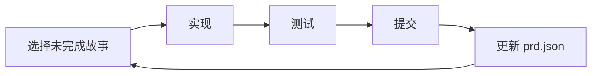

# Ralph 自主循环

Ralph 是一个自主 AI Agent 循环工具，让 Claude Code 反复执行任务直到产品需求文档（PRD）中的所有用户故事完成。每次迭代都使用全新的上下文，通过 Git 历史、`progress.txt` 和 `prd.json` 跨迭代传递记忆。

## 核心理念

Ralph 解决了一个关键问题：**单次 Claude Code 会话的上下文窗口有限**，无法一次性完成大型功能。Ralph 的方案是：

1. 将大功能拆分为多个**小型用户故事**（每个故事可在一次上下文窗口内完成）
2. 为每个故事**启动全新的 Claude Code 实例**
3. 通过 Git 提交和文件传递**跨迭代积累知识**
4. 循环执行直到所有故事完成



:::info
Ralph 基于 Geoffrey Huntley 的 "Ralph" 模式设计，核心思想是：**新鲜上下文 + 持久化记忆 = 可靠的自主开发**。
:::

## 安装

### 系统要求

- **Claude Code** — 必须已安装并认证
- **Git** — 项目必须是 Git 仓库
- **jq** — JSON 解析工具

### 方式一：通过 Claude Code Marketplace 安装（推荐）

```
> /plugin marketplace add snarktank/ralph
> /plugin install ralph-skills@ralph-marketplace
```

这会安装两个 Skills：

- `/prd` — 生成产品需求文档
- `/ralph` — 将 PRD 转换为 `prd.json` 格式

### 方式二：手动安装 Skills

```bash
# 克隆仓库
git clone https://github.com/snarktank/ralph.git /tmp/ralph

# 安装 Skills 到 Claude Code
cp -r /tmp/ralph/skills/prd ~/.claude/skills/
cp -r /tmp/ralph/skills/ralph ~/.claude/skills/

# 复制主脚本到项目
mkdir -p scripts/ralph
cp /tmp/ralph/ralph.sh scripts/ralph/
cp /tmp/ralph/CLAUDE.md scripts/ralph/
chmod +x scripts/ralph/ralph.sh
```

### 方式三：通过 CC-Switch 安装

如果你已安装 [CC-Switch](/guide/advanced/cc-switch)，可以通过 Skills 市场发现 Ralph 相关的社区 Skills：

1. 打开 CC-Switch Desktop
2. 进入 Skills 市场
3. 搜索 "ralph"
4. 选择需要的 Skills 安装到 Claude Code

:::tip
Ralph 的核心脚本 `ralph.sh` 需要复制到项目中。CC-Switch 主要用于发现和管理 Ralph 发布到 skills.sh 的独立 Skills（如 `/prd` 和 `/ralph`）。
:::

## 工作流

### 第一步：生成 PRD

使用 `/prd` Skill 让 Claude Code 帮你创建产品需求文档：

```
> /prd
我想给任务管理系统添加优先级功能
```

Claude Code 会先问你几个澄清问题，然后生成详细的 PRD，保存到 `tasks/prd-[feature-name].md`。

### 第二步：转换为 prd.json

使用 `/ralph` Skill 将 Markdown PRD 转换为结构化 JSON：

```
> /ralph
```

这会生成 `prd.json`，包含所有用户故事及其状态：

```json
{
  "project": "TaskManager",
  "branchName": "ralph/task-priority",
  "description": "Task Priority System",
  "userStories": [
    {
      "id": "US-001",
      "title": "Add priority field to database",
      "description": "As a developer, I need to store task priority.",
      "acceptanceCriteria": ["Add priority column to tasks table", "Generate and run migration", "Typecheck passes"],
      "priority": 1,
      "passes": false,
      "notes": ""
    }
  ]
}
```

### 第三步：运行 Ralph 循环

```bash
# 使用 Claude Code 运行（默认 10 次迭代）
./scripts/ralph/ralph.sh --tool claude

# 指定最大迭代次数
./scripts/ralph/ralph.sh --tool claude 20
```

Ralph 每次迭代会：

1. 从 PRD 的 `branchName` 创建功能分支
2. 选择优先级最高且 `passes: false` 的故事
3. 实现该故事
4. 运行质量检查（类型检查、测试）
5. 检查通过则提交
6. 更新 `prd.json`，标记为 `passes: true`
7. 将学习内容追加到 `progress.txt`
8. 重复直到所有故事完成或达到最大迭代次数

:::info
当所有故事的 `passes` 都为 `true` 时，Ralph 输出 `<promise>COMPLETE</promise>` 并退出。
:::

## 关键概念

### 新鲜上下文 + 持久化记忆

Ralph 的核心设计是**每次迭代使用全新的 Claude Code 实例**，避免上下文污染。记忆通过三个渠道传递：

| 渠道             | 作用                             |
| ---------------- | -------------------------------- |
| **Git 历史**     | 之前的代码变更和提交信息         |
| **progress.txt** | 学到的经验、发现的模式、常见问题 |
| **prd.json**     | 哪些故事已完成，哪些待处理       |

### 用户故事必须"大小合适"

每个 PRD 项目必须能在**一次上下文窗口内完成**。

**大小合适的故事：**

- 添加一个数据库列和迁移
- 给现有页面添加一个 UI 组件
- 更新一个 Server Action 的逻辑
- 给列表添加一个筛选下拉框

**太大的故事（需要拆分）：**

- "构建整个仪表盘"
- "添加认证系统"
- "重构整个 API"

:::warning
过大的故事会导致单次迭代无法完成，Ralph 会在下次迭代重试但可能重复工作。务必在 PRD 阶段做好拆分。
:::

### CLAUDE.md 更新

每次迭代后，Ralph 会更新项目中的 `CLAUDE.md` 文件，记录：

- 发现的代码模式和约定
- 常见问题和解决方案
- 项目特定的注意事项

这些信息在后续迭代中自动被 Claude Code 读取，形成**知识积累循环**。

## 配置

### 自定义提示模板

Ralph 使用 `CLAUDE.md` 作为 Claude Code 的提示模板。你可以在其中添加：

- 项目的质量检查命令（如 `npm run lint`、`npm test`）
- 代码规范和约定
- 常见陷阱和解决方案

### PRD 配置

`prd.json` 中的关键字段：

| 字段                 | 说明                                          |
| -------------------- | --------------------------------------------- |
| `branchName`         | 功能分支名称（建议以 `ralph/` 开头）          |
| `priority`           | 执行顺序（1 = 最高优先级）                    |
| `passes`             | 状态标志（`false` = 待处理，`true` = 已完成） |
| `acceptanceCriteria` | 验收标准（必须可验证）                        |

:::tip
验收标准应该包含可自动验证的条件，如 "Typecheck passes" 或 "Tests pass"。这让 Ralph 能自动判断故事是否完成。
:::

## 调试技巧

### 查看进度

```bash
# 检查哪些故事已完成
cat prd.json | jq '.userStories[] | {id, title, passes}'

# 查看之前迭代的经验
cat progress.txt

# 检查 Git 提交历史
git log --oneline -10
```

### 归档历史

Ralph 在开始新功能时会自动归档之前的运行记录到 `archive/YYYY-MM-DD-feature-name/`。

### 浏览器验证

对于前端相关的用户故事，建议在验收标准中加入：

```
Verify in browser using dev-browser skill
```

这会让 Ralph 使用浏览器自动化工具验证 UI 是否正确渲染。

## 与其他工具的关系

### Ralph vs Superpowers

[Superpowers](/guide/advanced/superpowers) 聚焦**单次会话内的结构化方法论**（TDD、头脑风暴、审查），Ralph 聚焦**跨迭代的自主循环**。两者可以结合：用 Superpowers 的 TDD 驱动每个迭代内的实现质量，用 Ralph 的循环机制驱动整体进度。

### Ralph vs Gstack

[Gstack](/guide/advanced/gstack) 提供 23+ 个工程角色 Skill，Ralph 提供一个自主循环脚本。Gstack 适合交互式精细控制，Ralph 适合"放手让它跑"的自主模式。

### Ralph vs OpenSpec

[OpenSpec](/guide/advanced/sdd/openspec) 聚焦规格文档的创建和管理，Ralph 聚焦规格的自动执行。可以组合：用 OpenSpec 的 `/opsx:propose` 创建需求规格，再用 Ralph 的循环机制自动实现。

更多 Skills 工具的关系对比，请参考[技能系统](/skills/)。

## 相关资源

- [Ralph GitHub](https://github.com/snarktank/ralph) — 项目仓库（19k+ Stars）
- [Ralph 交互式流程图](https://snarktank.github.io/ralph/) — 可视化工作流
- [Geoffrey Huntley 的 Ralph 模式](https://github.com/snarktank/ralph#readme) — 设计理念背景

## 下一步

- [自动化与 CI/CD](/guide/advanced/automation) — 将 Claude Code 集成到自动化流程
- [Superpowers 插件](/guide/advanced/superpowers) — 互补的结构化开发方法论
- [OpenSpec 规格驱动开发](/guide/advanced/sdd/openspec) — 互补的规格驱动方法
- [自定义技能](/skills/overview/custom-skills) — 创建和管理自定义 Skills
