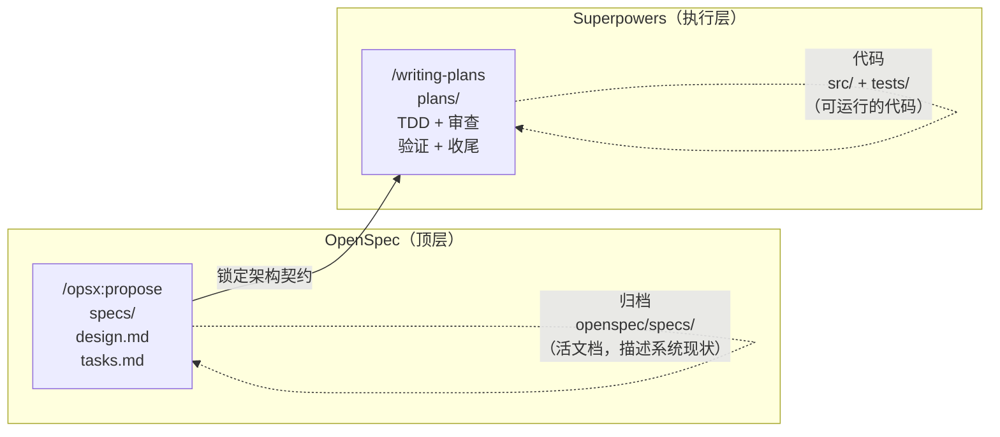

:::info {title="📊 页面导航"}
**适用角色与上手难度**

| 角色    | 推荐度 | 上手难度 |
| ------- | ------ | -------- |
| 🛠️ 开发 | ★★★★★  | ★★★★☆    |
| 🧪 测试 | ★★☆☆☆  | ★★★★★    |
| 📦 产品 | ★★★☆☆  | ★★★★★    |

**🎯 学习产出：** 掌握 OpenSpec 与 Superpowers 的双层规划模式，能独立配置桥接连接两层，实现"OpenSpec 锁定架构契约 + Superpowers 驱动执行落地"的企业级工作流

**🚀 AI 能力提升：** 规格驱动、多智能体
:::

# OpenSpec + Superpowers 双层规划

对于中大型项目，单一工具往往不够。OpenSpec 负责**顶层架构规划**（做什么），Superpowers 负责**执行细节落地**（怎么做），两者形成双层规划模式。

## 为什么需要双层规划

| 问题       | 只用 OpenSpec           | 只用 Superpowers        | 双层规划                                |
| ---------- | ----------------------- | ----------------------- | --------------------------------------- |
| 架构一致性 | ✅ 规格文档锁定契约     | ❌ 头脑风暴可能偏离方向 | ✅ OpenSpec 锁定架构                    |
| 执行纪律   | ❌ `/opsx:apply` 无 TDD | ✅ 强制 TDD + 代码审查  | ✅ Superpowers 驱动执行                 |
| 需求变更   | ✅ 增量提案             | ❌ 需要重新设计         | ✅ OpenSpec 增量 + Superpowers 重新执行 |
| 长期维护   | ✅ 规格是活文档         | ❌ 过程是临时的         | ✅ 规格持久化 + 执行纪律                |

:::tip
双层规划的核心思想：**OpenSpec 定"契约"，Superpowers 管"执行"**。架构一旦锁定，Superpowers 的所有实现都必须匹配 OpenSpec 的规格，不许擅自修改结构。
:::

## 适用场景

- 多模块、接口复杂的中大型工程
- 需要长期迭代维护的项目
- 多人协作、需要统一架构规范的团队
- 对接口契约和数据结构有严格要求的企业级项目

## 七步工作流

以"企业级 Express 接口限流中间件"为例：

### 第一步：OpenSpec 锁定架构契约

```text
> /opsx:propose 设计企业级限流中间件，定义配置结构、接口类型、错误规范、模块拆分
```

产出：

- 完整模块架构划分（配置模块、限流计算模块、异常模块）
- 固定数据结构、入参出参、错误码、字段约束
- 顶层宏观实现方案，形成不可随意变更的技术契约

### 第二步：Superpowers 细化执行计划

基于已固化的架构契约，Superpowers 将宏观设计拆解为可逐条执行的开发任务：

```text
> /superpowers:writing-plans
> 基于 OpenSpec 的架构规范，拆分最小执行开发步骤
```

产出：

- 目录结构创建顺序
- 模块编码优先级
- 依赖注入与集成顺序
- 单元测试编写节点
- 集成调试里程碑

### 第三步：TDD 驱动编码

```text
> /superpowers:subagent-driven-development
```

严格依照细化步骤，逐模块创建文件、编写代码，所有实现严格匹配 OpenSpec 架构规范。

### 第四步：系统化调试

```text
> /superpowers:systematic-debugging
> 高并发下限流统计异常
```

定位代码问题，修改后校验是否符合原始架构契约。

### 第五步：TDD 加固

```text
> /superpowers:test-driven-development
> 限流核心计算逻辑的边界测试
```

为核心模块编写边界测试，保证架构设计的功能稳定性。

### 第六步：代码审查

```text
> /superpowers:requesting-code-review
```

校验代码与 OpenSpec 架构规范一致性，统一代码规范。

### 第七步：归档

```text
> /opsx:archive
```

将最终架构规范、接口文档、代码实现永久归档，作为后续迭代的唯一依据。

## 双层规划的关系



1. **OpenSpec** 负责定大方向，解决项目"做成什么样"
2. **Superpowers** 负责拆小动作，解决代码"按什么顺序写"
3. 两层规划互不冲突，架构稳定且落地可控

## 桥接配置：让两层真正连通

双层规划最大的风险是"两层断裂"——OpenSpec 生成了规格，Superpowers 却从零开始头脑风暴，完全浪费了规格文档。以下是让两层真正连通的配置方法。

### 方案一：superpowers-bridge Schema

在 `openspec/config.yaml` 中指定 bridge schema：

```yaml
schema: superpowers-bridge
context:
  stack: 'Express + TypeScript + Prisma'
  testing: 'Vitest'
  language: '中文（简体）'
bridge:
  apply_skill: 'superpowers:subagent-driven-development'
```

配置后，`/opsx:apply` 会自动调用 Superpowers 的子智能体驱动开发来执行 tasks.md 中的任务。

### 方案二：手动串联

不使用 bridge schema，手动在 Apply 后调用 Superpowers：

```text
> /opsx:propose add-payment
> 创建支付功能的规格文档

> （审阅规格文档后）

> 使用 Superpowers 子智能体驱动开发，按照 OpenSpec 的 tasks.md 逐个实现
```

这种方式更灵活，但需要你手动告诉 Superpowers 去读 OpenSpec 的规格。

### 子智能体的职责

无论哪种方案，每个子智能体在执行任务时必须：

**读取（输入）：**

1. tasks.md 中的当前任务
2. proposal.md 中的目标和排除项
3. design.md 中的技术边界和架构决策
4. specs/ 中对应的需求规格
5. AGENTS.md / CLAUDE.md 中的项目规范

**报告（输出）：**

1. 修改了哪些文件
2. 运行了哪些验证命令及输出
3. 测试结果（通过/失败）
4. 未验证的路径（需要人工检查）
5. tasks.md 复选框是否可以勾选

:::warning
没有桥接的双层规划是断裂的。务必通过 config.yaml 配置 bridge schema，或在手动模式下明确告知 Superpowers 读取 OpenSpec 的规格文档。
:::

## 新手四步工作流

第一次使用双层规划？按以下步骤逐步引入：

### 第 1 步：安装 Superpowers

```text
> /plugin install superpowers@claude-plugins-official
```

用 `brainstorming` 先把需求梳理清楚。

### 第 2 步：安装 OpenSpec

```bash
npm install -g @fission-ai/openspec@latest
cd your-project && openspec init
```

用 `/opsx:propose` 将梳理清楚的需求规格化。

### 第 3 步：配置桥接

在 `openspec/config.yaml` 中配置 `superpowers-bridge` schema。

### 第 4 步：执行并归档

```text
> /opsx:apply
> （Superpowers 子智能体自动按规格 TDD 实现）

> /opsx:archive
> （归档规格，成为下次变更的基线）
```

:::tip
不需要一步到位。先单独用 Superpowers 做几个功能，感受 TDD 纪律；再引入 OpenSpec 管理规格；最后配置桥接让两者协同。逐步引入比一步到位更可靠。
:::

:::warning
双框架协同开发时最常见的问题是「两层断裂」——Superpowers 未读取 OpenSpec 的规范文档就开始写代码。务必在启动前确认 design.md 和 specs 已加载。遇到问题请参考[双框架踩坑指南](/guide/advanced/sdd/openspec-superpowers-pitfalls)。
:::

## 相关资源

- [OpenSpec 规格驱动开发](/guide/advanced/sdd/openspec) — OpenSpec 完整文档
- [Superpowers 插件](/guide/advanced/superpowers) — Superpowers 完整文档
- [任务中断与恢复](/guide/advanced/task-interruption-recovery) — 三层持久化和恢复策略
- [执行组合策略](/guide/advanced/sdd/execution-combinations) — 5 种执行组合详解
- [最佳实践：四阶段工作流](/tips/best-practices) — 更多工具组合场景
- [双框架踩坑指南](/guide/advanced/sdd/openspec-superpowers-pitfalls) — 7 个典型踩坑及规避方案
- [工作流故障排除](/guide/advanced/workflow-troubleshooting) — 通用故障诊断与修复
- [Comet 自动化流水线](/guide/advanced/comet) — 一键自动串联（替代手动桥接）
