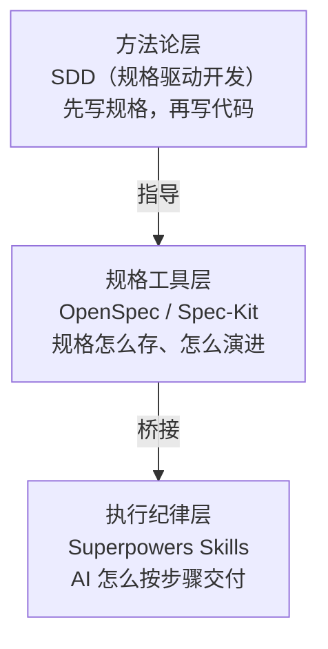

:::info {title="📊 页面导航"}
**适用角色与上手难度**

| 角色 | 推荐度 | 上手难度 |
|------|--------|----------|
| 🛠️ 开发 | ★★★★★ | ★★★★☆ |
| 🧪 测试 | ★★★☆☆ | ★★★★★ |
| 📦 产品 | ★★★☆☆ | ★★★★★ |

**🎯 学习产出：** 掌握规格驱动开发的三层模型（方法论层、规格工具层、执行纪律层），能独立辨析 SDD、OpenSpec、Spec-Kit 和 Superpowers 的定位与协作关系，做出正确的工具选型决策

**🚀 AI 能力提升：** 规格驱动、自动化工作流
:::

# SDD 方法论与工具辨析

很多人把 SDD、OpenSpec、Spec-Kit 和 Superpowers 混为一谈——安装了一堆工具却不知道它们各自解决什么问题，甚至让它们互相打架。本文梳理它们的关系，帮你做出正确的选择。

## 核心洞察：两个独立问题

AI 编程中有两个独立的问题：

1. **规格问题**：需要一份稳定的规格文档，告诉所有人"在改什么"
2. **执行问题**：需要约束 AI 执行者"按步骤来"，而不是自由发挥

这两个问题相关但**不可互换**。SDD 管规格，Superpowers 管执行——它们在不同的层面工作。

## 三层模型

| 层级           | 代表                                                                                | 解决的问题                          |
| -------------- | ----------------------------------------------------------------------------------- | ----------------------------------- |
| **方法论层**   | SDD（规格驱动开发）                                                                 | 为什么要先写规格再写代码            |
| **规格工具层** | [OpenSpec](/guide/advanced/sdd/openspec) / [Spec-Kit](/guide/advanced/sdd/spec-kit) | 规格怎么生成、存储、审查、演进      |
| **执行纪律层** | [Superpowers](/guide/advanced/superpowers) Skills                                   | AI 怎么按步骤执行、测试、验证、交付 |



:::tip
理解这个三层模型是正确使用工具的前提。很多人的困惑来源于试图用一个工具解决所有三个层面的问题——但它们本就是为不同层面设计的。
:::

## 方法论层：什么是 SDD

SDD（Spec-Driven Development，规格驱动开发）是一种**方法论**，不是工具。

传统开发中：

```text
需求（口头/聊天）→ 写代码 → 补文档（经常遗漏）
```

SDD 模式下：

```text
需求 → 写规格（人机协作）→ 审阅确认 → AI 按规格生成代码 → 规格成为活文档
```

### SDD 解决的两个核心痛点

**上下文中毒（Context Poisoning）**：当需求只存在于聊天记录中，无关信息会污染 AI 的上下文，导致输出偏离意图。

**注意力漂移（Attention Drift）**：在长对话中，AI 会逐渐偏离最初的需求。参数再大的模型也无法避免这种漂移。

SDD 通过**结构化的规格文档**作为人和 AI 之间的"接口"——接口清晰，AI 就能按意图工作；接口模糊，AI 越勤快，返工越多。

:::info
SDD 的核心理念：**规格是人与 AI 的接口（Interface）**。就像 API 是服务之间的接口——接口定义清楚了，调用方才能正确使用。
:::

### 不要跳过规格

最常见的错误是"需求想清楚了就直接写代码"。看起来省时间，实际上：

- 你脑中的需求 ≠ AI 理解的需求（没有规格，差异无从发现）
- 改着改着偏离了方向（没有规格，无从校准）
- 换一个 AI 会话就丢失了上下文（没有规格，知识不持久）

## 规格工具层：OpenSpec vs Spec-Kit

OpenSpec 和 Spec-Kit 都是 SDD 理念的工具实现，但定位不同：

### 一句话对比

| 工具         | 比喻                 | 定位                           |
| ------------ | -------------------- | ------------------------------ |
| **OpenSpec** | 项目内的规格演进记录 | 轻量、增量变更、适合现有项目   |
| **Spec-Kit** | 完整阶段的规格生产线 | 完整治理、从零开始、适合新项目 |

### 详细对比

| 方面         | OpenSpec                              | Spec-Kit                                                            |
| ------------ | ------------------------------------- | ------------------------------------------------------------------- |
| **安装**     | `npm install -g @fission-ai/openspec` | `uv tool install specify-cli`                                       |
| **运行时**   | Node.js                               | Python                                                              |
| **核心制品** | proposal → specs → design → tasks     | constitution → spec → plan → tasks                                  |
| **工作流**   | Propose → Apply → Archive（3 步核心） | Constitution → Specify → Clarify → Plan → Tasks → Implement（7 步） |
| **变更模型** | 增量提案，每个变更一个文件夹          | 按编号组织（001-feature-name）                                      |
| **独特能力** | 轻量快速，explore 零副作用探索        | Constitution 治理原则、Clarify 结构化澄清、Analyze 一致性分析       |
| **归档**     | 自动归档到 `openspec/archive/`        | 无内置归档，通过 Git 管理                                           |
| **团队协作** | `openspec sync` 同步、`bulk-archive`  | `taskstoissues` 同步到 GitHub Issues                                |
| **最佳场景** | 现有项目做增量功能                    | 新项目建立统一规范                                                  |

### 选择决策树

```text
你的情况是？
  ├─ 现有项目，需要快速添加功能
  │   └─→ OpenSpec（轻量、快速、增量变更）
  │
  ├─ 新项目，需要从头建立规范
  │   └─→ Spec-Kit（完整治理、Constitution 原则）
  │
  ├─ 多人团队，需要严格的规格审查和可追溯性
  │   └─→ Spec-Kit（Analyze 一致性分析、taskstoissues）
  │
  ├─ 个人项目，想要简单可控
  │   └─→ OpenSpec（3 步工作流，零配置上手）
  │
  └─ 不确定
      └─→ 先用 OpenSpec 试试（学习成本低，不满意再换）
```

:::tip
两者不冲突。你可以在同一个项目的不同功能上分别使用 OpenSpec 和 Spec-Kit——重要功能用 Spec-Kit 的完整流程，小改动用 OpenSpec 的快速提案。
:::

## 执行纪律层：Superpowers

[Superpowers](/guide/advanced/superpowers) 不是规格工具——它是 AI 协作者的"岗位手册"。它约束 AI 的行为：

| 需求状态 | Superpowers 的行为                                  |
| -------- | --------------------------------------------------- |
| 需求模糊 | 触发 `brainstorming`，通过提问澄清                  |
| 需求明确 | 触发 `writing-plans`，拆分实现计划                  |
| 开始编码 | 强制 `test-driven-development`，RED-GREEN-REFACTOR  |
| 声称完成 | 触发 `verification-before-completion`，要求提供证据 |

Superpowers 不管规格存在在哪里——它可以读 OpenSpec 的 tasks.md，也可以读 Spec-Kit 的 tasks.md，甚至读你手写的 TODO 列表。它只关心**执行过程的纪律**。

## 关键问题：桥接

一个常见困惑：OpenSpec 生成了 tasks.md，但 Superpowers 怎么知道要读它？如果没有"桥接"，两个工具各干各的——OpenSpec 生成了规格，Superpowers 从零开始头脑风暴，完全浪费了规格文档。

### 桥接方案：通过 config.yaml 连接

在 `openspec/config.yaml` 中配置 `superpowers-bridge` Schema，让 OpenSpec 的 Apply 阶段自动调用 Superpowers：

```yaml
schema: superpowers-bridge
context:
  stack: 'Express + TypeScript + Prisma'
  testing: 'Vitest'
  language: '中文（简体）'
bridge:
  apply_skill: 'superpowers:subagent-driven-development'
  requirements:
    - '每个子智能体必须读取当前任务、proposal 的目标和排除项、design 的技术边界'
    - '每个子智能体完成后必须报告：修改的文件、运行的验证命令、测试结果、未验证路径'
    - '只有报告完整且测试通过，tasks.md 中的复选框才能勾选'
```

### 桥接后的工作流

```text
OpenSpec: /opsx:propose  →  生成 proposal.md + specs/ + design.md + tasks.md
                                    ↓ 桥接
Superpowers: 每个 task  →  子智能体读取规格 → TDD 实现 → 报告 → 勾选
                                    ↓
OpenSpec: /opsx:archive  →  归档
```

### 子智能体必须读取的上下文

每个子智能体在执行任务时，需要读取：

1. **当前任务**：tasks.md 中的当前复选框项
2. **目标与排除项**：proposal.md 中定义的范围
3. **技术边界**：design.md 中的架构决策
4. **规格增量**：specs/ 中对应的需求变更
5. **项目规范**：AGENTS.md 或 CLAUDE.md 中的开发约定

### 子智能体必须报告的产出

每个子智能体完成后，需要报告：

1. 修改了哪些文件
2. 运行了哪些验证命令及其输出
3. 测试结果（全部通过 / 有失败）
4. 哪些路径未验证（需要人工检查）
5. tasks.md 中的复选框是否可以勾选

:::warning
没有桥接的双层规划是断裂的——OpenSpec 生成了规格却没人用，Superpowers 做了头脑风暴却和规格无关。务必配置桥接。
:::

## 新手推荐：四步工作流

如果你刚接触这些工具，不需要一次全部安装。按以下顺序逐步引入：

### 第一步：Superpowers 澄清模糊需求

安装 Superpowers，用 `brainstorming` 把你的想法梳理清楚：

```text
> /superpowers:brainstorming
> 我想给应用添加多语言支持
```

Superpowers 会提问：哪些语言？翻译文件格式？动态切换还是构建时选择？浏览器语言自动检测？

### 第二步：OpenSpec 或 Spec-Kit 将需求规格化

需求梳理清楚后，用规格工具将其固化为文档：

```text
> /opsx:propose add-i18n
> 基于头脑风暴的结果，创建多语言支持的规格文档
```

规格文档提交到 Git，成为持久化的"真相源"。

### 第三步：Superpowers 约束实现过程

规格确认后，用 Superpowers 的 TDD 纪律驱动实现：

```text
> 使用 Superpowers 工作流，按照 OpenSpec 的任务清单实现多语言支持
```

Superpowers 确保每个任务都经过 TDD（先测试后代码）、代码审查、证据验证。

### 第四步：收集证据，更新规格

实现完成后，运行验证命令，收集证据，归档规格：

```text
> pnpm test && pnpm type-check && pnpm lint

> /opsx:archive
```

归档后的规格描述了系统的新状态，成为下一次变更的起点。

### 完整链条

```text
意图 → 规格 → 任务 → 执行 → 验证 → 审查 → 归档
 ↑                                         ↓
 └─────────── 下一次变更从这里开始 ──────────┘
```

:::info
SDD 提醒你不要从意图直接跳到代码。OpenSpec/Spec-Kit 帮规格住在仓库里。Superpowers 约束 AI 按步骤执行并收集证据后才能声明完成。
:::

## 工具全景对比

| 工具                             | 层级     | 核心理念                  | 持久化           | 适用阶段           |
| -------------------------------- | -------- | ------------------------- | ---------------- | ------------------ |
| **SDD**                          | 方法论   | 先写规格再写代码          | —                | 全程               |
| **OpenSpec**                     | 规格工具 | 增量提案 + 归档           | 规格提交到 Git   | 需求 → 设计 → 任务 |
| **Spec-Kit**                     | 规格工具 | Constitution + 7 步工作流 | 规格提交到 Git   | 需求 → 设计 → 任务 |
| **Superpowers**                  | 执行纪律 | TDD + 铁律 + 证据验证     | 过程临时，不保留 | 任务 → 编码 → 审查 |
| [Gstack](/guide/advanced/gstack) | 工程保障 | 虚拟团队 + 浏览器 QA      | —                | 测试 → 审查 → 发布 |
| [Ralph](/guide/advanced/ralph)   | 自动化   | 自主循环执行              | progress.txt     | 批量实现           |

## 常见误区

### 误区一：安装了 OpenSpec 就不需要 Superpowers

OpenSpec 管规格，Superpowers 管执行。没有 Superpowers，`/opsx:apply` 不会强制 TDD、不会做代码审查、不会要求提供验证证据。

### 误区二：Superpowers 可以替代 OpenSpec

Superpowers 的 `brainstorming` 产出的设计文档是临时的。如果你需要持久化的需求规格（活文档、增量变更、团队共享），需要 OpenSpec 或 Spec-Kit。

### 误区三：Spec-Kit 和 OpenSpec 不能共存

它们可以在同一个项目中并存——重要功能走 Spec-Kit 的完整 7 步，小改动走 OpenSpec 的快速 3 步。

### 误区四：必须一次安装所有工具

从 Superpowers 开始。需要规格持久化时加 OpenSpec。需要浏览器 QA 时加 Gstack。逐步引入，不要一步到位。

## 相关资源

- [OpenSpec 规格驱动开发](/guide/advanced/sdd/openspec) — 轻量级规格工具
- [Spec-Kit 规格驱动开发](/guide/advanced/sdd/spec-kit) — 完整规格生产线
- [Superpowers 插件](/guide/advanced/superpowers) — 结构化开发方法论
- [OpenSpec + Superpowers 双层规划](/guide/advanced/sdd/openspec-superpowers) — 企业级双层规划工作流
- [AGENTS 全局路由协议](/guide/advanced/agents-routing) — 多框架协调方案
- [最佳实践](/tips/best-practices) — 四阶段工作流和业务场景

## 下一步

- [AGENTS 全局路由协议](/guide/advanced/agents-routing) — 当多个框架共存时如何协调
- [OpenSpec + Superpowers 双层规划](/guide/advanced/sdd/openspec-superpowers) — 双层规划的完整工作流
- [最佳实践：四阶段工作流](/tips/best-practices) — 将所有工具组合为完整流程
