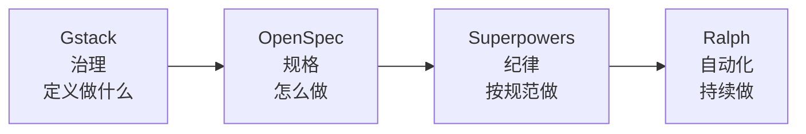

# 最佳实践

## 对话技巧

### 1. 提供具体上下文

```
❌ "帮我修个 bug"
✅ "用户登录后 token 没有保存到 localStorage，检查 src/auth/login.ts 的登录逻辑"
```

### 2. 指定范围

```
❌ "优化这个项目"
✅ "优化 src/api/users.ts 中的数据库查询，目前列表接口没有分页"
```

### 3. 分步完成

```
> 第一步：分析 src/database/ 的表结构
> 第二步：添加索引优化查询
> 第三步：运行测试确认没有回归
```

### 4. 利用 CLAUDE.md

在 `CLAUDE.md` 中记录项目约定，这样每次对话都不用重复说明。

## 工作流模式

### 基础模式

#### TDD 模式

```
> 用 TDD 方式实现一个邮箱验证函数：
> 1. 先写测试
> 2. 运行测试确认失败
> 3. 写最小实现让测试通过
> 4. 重构优化
```

#### 审查模式

```
> /plan
> 帮我规划一下如何重构 src/auth/ 模块，分析现有的问题和改进方案
```

#### 探索模式

```
> 我刚接手这个项目，帮我：
> 1. 梳理整体架构
> 2. 找到核心业务逻辑
> 3. 识别潜在的技术债务
```

:::tip
如果同时安装了 Superpowers 和 Gstack，建议先阅读 [AGENTS 全局路由协议](/guide/advanced/agents-routing)，明确两者的分工和优先级，避免工具冲突。想理解 SDD、OpenSpec、Spec-Kit、Superpowers 的关系？请参考 [SDD 方法论与工具辨析](/guide/advanced/sdd/sdd-guide)。
:::

### 持久记忆策略

默认情况下，Claude Code 每次新会话都会"失忆"。对于长期项目，推荐使用 [Claude-Mem](/guide/advanced/claude-mem) 实现自动化的跨会话记忆。

```
# 安装 Claude-Mem（一次性）
> npx claude-mem install
```

安装后无需额外操作——Claude-Mem 在后台自动工作：

- **会话中**：自动捕获工具调用和关键发现
- **新会话启动**：自动注入相关的历史上下文
- **搜索记忆**：通过 MCP 工具用自然语言查询项目经验

```
> 搜索之前关于性能优化的讨论
> 上次重构 auth 模块时遇到了什么问题？
```

:::tip
Claude-Mem 与 CLAUDE.md **互补使用**：CLAUDE.md 记录静态的项目约定和规则，Claude-Mem 记录动态的工作经验和发现。两者结合，Claude Code 既有"骨架"（约定）又有"记忆"（经验）。
:::

### 四阶段工作流：从想法到发布

当你的项目足够复杂，需要一套完整的开发流程时，可以组合使用四个工具，形成从想法到发布的闭环：



#### 阶段一：Gstack 治理——定义做什么

[Gstack](/guide/advanced/gstack) 提供工程团队视角的治理能力，帮你用 YC 式的提问和多角色审查来**定义正确的问题**。

```
> /office-hours
> 我想给 SaaS 产品添加多租户支持

> /plan-ceo-review
> 审查这个功能的商业价值和优先级

> /plan-eng-review
> 审查技术架构方案
```

Gstack 的 `/office-hours` 会用 6 个核心问题帮你挖掘真实需求，`/plan-ceo-review` 和 `/plan-eng-review` 从不同角度审查方案。**确保你在解决正确的问题。**

:::tip
不确定该做什么功能？先用 `/office-hours` 做产品拷问，再用 `/plan-ceo-review` 确定优先级。
:::

#### 阶段二：OpenSpec 规格——定义怎么做

[OpenSpec](/guide/advanced/sdd/openspec) 将治理阶段的决策转化为**结构化的规格文档**，让 AI 和人对齐"要构建什么"。

```
> /opsx:propose add-multi-tenancy
> 基于 Gstack 的审查结果，创建多租户功能的规格文档

> /opsx:apply
> 按照规格文档的任务清单实现
```

OpenSpec 的规格文档（proposal → specs → design → tasks）提交到 Git，成为**持久化的项目文档**。下次修改时，新的提案基于已有规格生成增量变更。

:::info
规格文档是活文档——它描述系统当前的行为。归档后，新提案会基于这些规格生成增量变更。
:::

:::tip
更复杂的项目可以使用 [Spec-Kit](/guide/advanced/sdd/spec-kit) 替代 OpenSpec——它提供完整的 7 步工作流（Constitution → Specify → Clarify → Plan → Validate → Tasks → Implement），支持结构化的需求澄清和跨工件一致性分析。详见 [Spec-Kit 规格驱动开发](/guide/advanced/sdd/spec-kit)。
:::

#### 阶段三：Superpowers 纪律——按规范执行

[Superpowers](/guide/advanced/superpowers) 在实现阶段提供**开发纪律**——强制执行 TDD、头脑风暴、代码审查。

```
> 使用 Superpowers 工作流，按照 OpenSpec 的任务清单实现多租户功能
```

Superpowers 会：

1. **头脑风暴**：在写代码前充分理解需求
2. **TDD**：每个任务先写测试再实现
3. **代码审查**：对照规格文档审查实现质量
4. **完成验证**：有证据才能说完成

Superpowers 的开发纪律建立在**三条铁律**之上：

1. **没有设计，不写代码** — 头脑风暴是硬门控，需求不清不开始
2. **没有测试，不写代码** — TDD 是强制的，先写代码会被要求删除
3. **没有验证，不说完成** — 必须提供新鲜的命令输出作为完成证据

遇到 Bug 时，使用 `systematic-debugging` 的四阶段流程（复现→根因→修复→防护），配合"三振出局"规则——同一问题尝试 3 次未解决则自动升级。

:::warning
Superpowers 严格执行"先测试后代码"规则。如果代码在测试之前写好，会被要求删除重来。
:::

#### 阶段四：Ralph 自动化——持续执行

[Ralph](/guide/advanced/ralph) 将规格文档转化为**自主循环执行**，适合大型功能的批量实现。

```
> /prd
> 将 OpenSpec 的规格转换为 PRD

> /ralph
> 将 PRD 转换为 prd.json
```

然后在终端运行：

```bash
./scripts/ralph/ralph.sh --tool claude
```

Ralph 每次迭代使用**全新上下文**，通过 Git 历史和 `progress.txt` 跨迭代积累知识。所有故事完成后自动退出。

:::tip
Ralph 特别适合"离开电脑，回来时功能已经开发完毕"的场景。确保 PRD 中的用户故事足够小，每个故事能在一次上下文窗口内完成。
:::

### 四阶段组合场景

#### 场景一：新功能开发（完整流程）

```
1. Gstack: /office-hours 探索需求 → /plan-eng-review 审查架构
2. OpenSpec: /opsx:propose 创建规格 → 审阅规格文档
3. Superpowers: TDD 驱动实现 → 代码审查
4. Gstack: /review 审查代码 → /qa 测试 → /ship 发布
```

#### 场景二：快速迭代（跳过规格）

```
1. Gstack: /plan-ceo-review 确认优先级
2. Superpowers: 头脑风暴 → TDD → 审查
3. Gstack: /ship 发布
```

#### 场景三：大型功能自主开发

```
1. Gstack: /office-hours + /plan-eng-review 定义方向
2. OpenSpec: /opsx:propose 创建详细规格
3. Ralph: 将规格转为 PRD → 自主循环执行
4. Gstack: /review + /qa 做最终审查
```

#### 场景四：代码审查和质量保障

```
1. CodeGraph: 快速探索代码结构
2. Code Review Graph: Blast-Radius 影响分析
3. Graphify: 多模态知识图谱（适用于混合材料场景）
4. Gstack: /review Staff Engineer 级审查 + /cso 安全审计
```

#### 场景五：大型重构（语义驱动）

```
1. Serena: find_referencing_symbols 分析影响范围
2. Gstack: /plan-eng-review 审查重构方案
3. Serena: rename_symbol 精确重命名 → move_symbol 重组模块
4. CodeGraph: codegraph_impact 验证变更完整性
5. Gstack: /review 审查 → /qa 测试
```

#### 场景六：遗留代码接管

```
1. Serena + CodeGraph: get_symbols_overview + codegraph_explore 快速理解代码结构
2. Gstack: /office-hours 梳理业务需求
3. Serena: find_referencing_symbols 追踪核心业务流
4. OpenSpec: /opsx:propose 基于代码现状创建重构规格
5. Superpowers: TDD 驱动渐进式重构
```

### 实时文档注入（Context7）

安装 [Context7](/guide/advanced/context7) 后，Claude Code 会自动查询最新的库文档：

```bash
npx ctx7 setup --claude
```

之后 Claude Code 在使用库/框架时会自动获取最新文档，避免 API 幻觉和过时代码。特别适合使用快速迭代的库（如 Next.js、React Router）。

### 代码语义辅助（Serena）

安装 [Serena](/guide/advanced/serena) 后，Claude Code 获得 IDE 级的符号级代码操作能力：

```bash
uv tool install -p 3.13 serena-agent
serena init
claude mcp add --scope user serena -- serena
```

Serena 在四阶段工作流中的价值：

- **Gstack 阶段**：用 `find_referencing_symbols` 分析变更影响范围，辅助架构审查
- **OpenSpec 阶段**：用 `get_symbols_overview` 快速理解现有代码结构，为规格文档提供准确的现状描述
- **Superpowers 阶段**：用 `rename_symbol`、`replace_symbol_body` 进行精确的符号级重构，比文本替换更安全
- **Ralph 阶段**：在自主迭代中，语义操作减少误改风险，提高大型重构的可靠性

:::tip
Serena 特别适合重构密集型任务——重命名跨文件的符号、移动函数到新模块、安全删除废弃代码。这些操作用文本搜索容易出错，Serena 通过 LSP 保证原子化和精确性。
:::

### 开发效率增强（ECC）

[ECC](/tips/ecc)（Enhanced Claude Code）是一个生产级的 Claude Code 增强系统，通过 Plugin 方式一键安装：

```bash
# 在 Claude Code 中执行
/plugin marketplace add https://github.com/affaan-m/ECC
/plugin install ecc@ecc
```

ECC 在四阶段工作流中的价值：

- **Gstack 阶段**：`planner` agent 辅助功能规划，`architect` agent 提供架构建议
- **OpenSpec 阶段**：`deep-research` skill 提供技术调研，`docs-lookup` agent 查询 API 文档
- **Superpowers 阶段**：`tdd-workflow` skill 驱动测试先行，`code-reviewer` agent 自动审查
- **Ralph 阶段**：`autonomous-loops` skill 支持自主循环执行，`loop-operator` agent 管理循环状态

ECC 还内置了 [AgentShield](https://github.com/affaan-m/ECC#security) 安全扫描，覆盖密钥泄露、权限审计、Hook 注入等 5 大安全类别。

:::tip
ECC 是"全家桶"方案——249 个 Skill 覆盖 12+ 语言生态。如果只需要特定能力（如安全扫描），可用 `npx ecc consult "security reviews"` 按需安装。详见 [ECC 完整文档](/tips/ecc)。
:::

### 规格驱动开发（Spec-Kit）

[Spec-Kit](/guide/advanced/sdd/spec-kit) 是 GitHub 官方的规格驱动开发（SDD）工具包，将规格文档作为开发的核心产物，AI Agent 根据规格自动生成实现代码。

```bash
# 安装
uv tool install specify-cli --from git+https://github.com/github/spec-kit.git@latest

# 初始化项目（Claude Code 集成）
specify init . --integration claude
```

Spec-Kit 在四阶段工作流中的价值：

- **Gstack 阶段**：Spec-Kit 的 `/speckit.clarify` 通过结构化 Q&A 深入挖掘需求，补充 Gstack 的 `/office-hours` 拷问
- **OpenSpec 阶段**：Spec-Kit 可以**替代** OpenSpec 的规格工作——它提供更完整的 Constitution（治理原则）、Clarify（需求澄清）和 Analyze（一致性分析）
- **Superpowers 阶段**：`/speckit.implement` 内置 TDD 流程，可与 Superpowers 的开发纪律叠加使用
- **Ralph 阶段**：Spec-Kit 的 `/speckit.tasks` 生成带依赖关系的任务列表，可直接驱动 Ralph 的自主循环

:::tip
选择 OpenSpec 还是 Spec-Kit？**简单项目用 OpenSpec**（轻量、快速），**复杂项目用 Spec-Kit**（完整治理、需求澄清、一致性分析、团队协作）。两者不冲突——可以在同一个项目的不同功能上分别使用。
:::

### 业务场景实战

以下场景展示了如何将四阶段工具链与 ECC、Context7、Serena 组合，解决真实的业务开发需求。

#### 业务场景一：新 SaaS 功能开发

从需求到上线的完整闭环：

```
1. Gstack: /office-hours 探索多租户需求 → /plan-eng-review 审查架构方案
2. ECC: /ecc:plan 创建详细实现蓝图 → deep-research 调研技术方案
3. OpenSpec: /opsx:propose 生成结构化规格文档
4. Superpowers + ECC: tdd-workflow 驱动测试先行 → code-reviewer 自动审查
5. Context7: 自动获取 Next.js / Supabase 最新 API 文档
6. ECC: security-review 进行安全审查 → /ship 发布
```

#### 业务场景二：遗留系统安全加固

对已有项目进行安全审计和加固：

```
1. ECC AgentShield: npx ecc-agentshield scan --opus --stream 深度安全扫描
2. Serena: find_referencing_symbols 追踪敏感数据流向
3. ECC: security-reviewer agent 逐模块审查安全问题
4. Code Review Graph: Blast-RADIUS 影响分析
5. Graphify: 多模态知识图谱（适用于混合材料场景）
6. Superpowers: TDD 驱动安全修复 → 回归测试
7. ECC: security-review skill 最终审查
```

#### 业务场景三：跨语言微服务重构

同时涉及 Go、TypeScript、Python 的微服务项目：

```
1. ECC: /multi-plan 分解跨服务任务 → /multi-backend 和 /multi-frontend 分别编排
2. Serena: get_symbols_overview 快速理解各服务代码结构
3. ECC: 自动加载对应语言的 Rules（go-reviewer + typescript-reviewer + python-reviewer）
4. OpenSpec: /opsx:propose 为每个服务创建独立重构规格
5. Ralph: 将规格转为 PRD → 自主循环执行各服务重构
6. ECC: database-reviewer 审查数据库迁移 → e2e-testing 验证跨服务集成
```

#### 业务场景四：AI 产品快速迭代

需要快速实验和迭代的 AI 产品开发：

```
1. ECC: /ecc:plan 规划 MVP 功能 → mle-workflow skill 设计 ML 流水线
2. Superpowers: 头脑风暴 → TDD 快速实现
3. ECC: pytorch-patterns skill 规范模型代码 → mle-reviewer agent 审查生产就绪度
4. Ralph: 自主循环实现剩余用户故事
5. ECC: e2e-testing skill 编写端到端测试 → security-scan 上线前安全检查
```

#### 业务场景五：大型企业项目（规格驱动）

需要严格的需求治理和可追溯性的企业级项目：

```
1. Gstack: /office-hours 深入挖掘业务需求 → /plan-ceo-review 确定优先级
2. Spec-Kit: /speckit.constitution 建立项目治理原则
3. Spec-Kit: /speckit.specify 编写结构化规格 → /speckit.clarify 澄清模糊点
4. Spec-Kit: /speckit.plan 生成技术方案 → /speckit.analyze 验证一致性
5. Superpowers: TDD 驱动实现 → 代码审查
6. Spec-Kit: /speckit.taskstoissues 将任务同步到 GitHub Issues → 团队协作
```

:::info
Spec-Kit 特别适合多人协作的企业项目——Constitution 确保团队遵循统一原则，结构化规格消除歧义，`/speckit.taskstoissues` 自动同步任务到 GitHub Issues 实现项目管理自动化。
:::

:::info
以上业务场景均可根据项目实际情况灵活组合。核心原则：**治理先行（Gstack/OpenSpec/Spec-Kit）→ 纪律执行（Superpowers/ECC TDD）→ 安全审查（ECC AgentShield）→ 自动化交付（Ralph/ECC 自主循环）**。
:::

#### 业务场景六：生产环境性能退化排查

从症状到根因的系统化排查：

```text
1. Superpowers: /superpowers:systematic-debugging 启动系统化排查
2. CodeGraph: codegraph_trace 追踪慢接口的完整调用链
3. Serena: find_referencing_symbols 分析最近变更的影响范围
4. Superpowers: TDD 驱动修复 → 先写能暴露性能问题的基准测试
5. Gstack: /review 审查修复方案 → /benchmark 验证性能恢复
```

## 省钱技巧

1. **及时 /compact**：每 10-15 轮对话压缩一次
2. **精确指定文件**：不要让 Claude 读整个项目
3. **用 /clear 重启**：切换任务时清空上下文
4. **监控 /cost**：定期检查 token 用量
5. **日常用 Sonnet**：复杂问题才切 Opus

### Skills 选择策略

不要全量加载所有 Skills！根据项目规模选择合适的组合：

| 组合           | Token 消耗  | 适用场景    |
| -------------- | ----------- | ----------- |
| 全量 14 Skills | ~50K tokens | ❌ 不推荐   |
| 5 核心 Skills  | ~15K tokens | ✅ 推荐     |
| 3 最小 Skills  | ~8K tokens  | ⚠️ 基础保障 |

**推荐 5 个核心 Skills：**

```json
{
  "always_active": ["test-driven-development", "verification-before-completion"],
  "on_demand": ["writing-plans", "requesting-code-review", "systematic-debugging"]
}
```

### 变更管理策略

根据变更规模选择不同的工作流：

**小型变更（< 1 天）：**

```text
> /opsx:ff "修复登录接口密码验证 bug"
# 使用 TDD（必选）+ Verification（必选）
```

**中型变更（1-3 天）：**

```text
> /opsx:propose "添加用户个人资料功能"
# 使用 Planning + TDD + Code Review + Verification
```

**大型变更（> 3 天）：**

```text
> /opsx:propose "用户系统重构"
# 拆分为多个子变更，每个子变更独立走完整流程
# 使用 Brainstorming + Git Worktree + Planning + TDD + Code Review + Verification
```

### 上下文管理策略

OpenSpec + Superpowers 同时注入上下文时，Token 消耗较大。建议分层加载：

| 阶段     | 加载内容                        | 不加载                 | Token 消耗 |
| -------- | ------------------------------- | ---------------------- | ---------- |
| 规格定义 | proposal.md + design.md + specs | Superpowers Skills     | ~10K       |
| 任务实现 | tasks.md + 5 核心 Skills        | 完整 specs（按需查询） | ~20K       |
| 验证归档 | specs + 验证报告模板            | Superpowers Skills     | ~8K        |

### Provider 管理

使用 [CC-Switch](/guide/advanced/cc-switch) 管理多个 API Provider，快速在不同服务间切换：

- 一键切换 Provider，无需手动编辑配置文件
- 支持 AWS Bedrock、NVIDIA NIM 等 50+ 预设
- 用量追踪帮助你监控花费

## 团队协作

### 共享 CLAUDE.md

把 `CLAUDE.md` 提交到 Git，让整个团队共享项目约定。

### 共享 Skills

把 `.agents/skills/` 提交到 Git，让团队复用工作流。

### Code Review

```
> 帮我审查 main..feature 分支的改动，重点关注安全性和性能
```

### 工具选择：SDD 三层模型

不确定该用 OpenSpec 还是 Spec-Kit？不确定 Superpowers 和它们的关系？参考 [SDD 方法论与工具辨析](/guide/advanced/sdd/sdd-guide) 的三层模型：

- **方法论层**：SDD 告诉你"为什么要先写规格"
- **规格工具层**：OpenSpec（轻量增量）或 Spec-Kit（完整治理）帮你管规格
- **执行纪律层**：Superpowers 约束 AI 按步骤执行

## 常见问题

### Claude Code 似乎"忘记"了之前的内容

对话太长了，执行 `/compact` 或 `/clear` 后重新开始。

### Claude Code 的修改不符合预期

- 检查 `CLAUDE.md` 中是否有明确的约定
- 用 `/plan` 模式先确认方案再执行
- 对于关键修改，要求 Claude 先解释再动手

### 响应速度变慢

- 对话上下文可能过大，执行 `/compact`
- 检查是否加载了过多的 MCP 服务器
- 考虑切换到更快的模型（如 Haiku）

### MCP 服务器不响应

- 检查 MCP 服务器进程是否存活：`claude mcp list`
- 重启服务器：`claude mcp remove <name>` 后重新添加
- 查看 [MCP 服务器配置](/guide/advanced/mcp-servers) 排查连接问题

### Skills 未自动触发

- 检查 Skills 路径：`ls ~/.claude/skills/`
- 重新安装插件
- 参考 [工作流故障排除](/guide/advanced/workflow-troubleshooting) 的详细诊断步骤

### 双框架协同开发时 AI 偏离需求

- 确保 `tasks.md` 每个任务都有明确的 DoD（Definition of Done）
- 启动 Superpowers 前强制加载 OpenSpec 的 design.md 和 specs
- 参考 [双框架踩坑指南](/guide/advanced/sdd/openspec-superpowers-pitfalls) 的完整解决方案
