# 用 Claude Code 做测试

> 传统方式 4-6 小时出一份测试用例。Claude Code 20 分钟。不是替代测试工程师——是让测试工程师快 10 倍。

## 先看对比：同一任务，两种方式

**任务：拿到一份 5 页 PRD（用户注册功能），出完整测试用例 + 可执行测试代码。**

```mermaid
gantt
    title       PRD → 测试用例 + 代码，两种方式对比
    dateFormat  HH:mm
    axisFormat  %H:%M

    section 传统方式（4-6h）
    读 PRD 理解需求           :done, t1, 00:00, 30min
    手写测试点               :done, t2, after t1, 60min
    整理用例文档             :done, t3, after t2, 30min
    设计测试数据             :done, t4, after t3, 30min
    写测试代码               :done, t5, after t4, 90min
    调试跑通                 :done, t6, after t5, 30min
    补边界用例               :done, t7, after t6, 30min
    整理文档                 :done, t8, after t7, 30min

    section Claude Code（~20min）
    贴 PRD + 一句话提示词     :active, c1, 00:00, 2min
    CC 输出 Given-When-Then  :active, c2, after c1, 5min
    审查 + 追问边界           :active, c3, after c2, 10min
    完成                      :milestone, after c3, 0min
```



| 维度 | 传统方式 | Claude Code |
|------|---------|-------------|
| 耗时 | 4-6 小时 | ~20 分钟 |
| 步骤 | 8 步 | 3 步 |
| 用例格式 | 因人而异 | 结构化 Given-When-Then + P0/P1/P2 |
| 边界遗漏率 | 15-20% | 5-10%（追问自审后） |
| 可追溯性 | 需手动关联 | 每条用例关联文档段落 |

## 准备工作：安装这些

开始之前，花 5 分钟装好 Claude Code 的测试相关插件。不需要全装——按你要做的事情选。

| 工具/插件 | 干什么 | 安装命令 | 用到哪章 |
|-----------|--------|---------|---------|
| **Superpowers** | 头脑风暴、写计划、TDD 流程 | `/plugin install superpowers@claude-plugins-official` | 全部章节 |
| **Playwright MCP** | 浏览器自动化 + 截图对比 | `/plugin install playwright@claude-plugins-mcp` | 第 6 章 |
| **codegraph** | 代码调用链追踪，白盒分析 | `npm i -g @colbymchenry/codegraph && codegraph install` | 第 7 章 |
| **pytest** | Python 测试框架 | `pip install pytest pytest-cov` | 第 5、7 章 |
| **vitest** | 前端测试框架 | `npm i -D vitest` | 第 4 章 |
| **Ponytail**（可选） | 出用例时压住过度设计 | `/plugin install ponytail@ponytail` | 全部章节 |

:::tip 最小配置
只跟第 2 章小白教程走一遍：装 **Superpowers + 一个你顺手的测试框架**（pytest 或 vitest）就够了。Playwright 和 codegraph 用到对应场景时再装。
:::

## 概述

### 这是什么

Claude Code 不是测试框架——它是**测试加速器**。它不会替代 `pytest`、`vitest`、`Playwright`，而是在你现有的测试工具链前面加一层：

```text
输入（PRD/API 文档/设计稿/源代码）
        ↓
  Claude Code 分析 & 生成   ← 本文讲这部分
        ↓
  pytest / vitest / Playwright 执行  ← 你已经在用的工具
        ↓
  Claude Code 读报告 & 补漏
        ↓
  完成
```

### 核心概念：四源输入 × 黑白双轨

| 输入源 | 黑盒视角 | 白盒视角 | 主力工具 |
|--------|---------|---------|---------|
| **PRD / 需求文档** | 等价类、边界值、场景组合 | 读代码补异常路径 | 无（纯 Claude Code） |
| **API 文档（OpenAPI）** | 状态码、参数边界、鉴权 | 读 handler 补分支覆盖 | pytest + httpx |
| **设计稿（Axure/Figma）** | 交互路径、视觉一致性 | 组件单元测试 | Playwright |
| **遗留代码** | 接口行为梳理 | 分支/路径覆盖补漏 | codegraph + coverage |

### 阅读路线

| 你的情况 | 从哪里开始 |
|----------|-----------|
| 第一次用 AI 做测试 | → [第 2 章：小白教程](#小白教程——10-分钟上手) |
| 手里有 PRD，要出用例 | → [第 4 章：PRD → 测试用例](#场景一prd--测试用例) |
| 有 Swagger 文档，要写接口测试 | → [第 5 章：API 文档 → 接口测试](#场景二api-文档--接口测试) |
| 设计师给了原型，要验收 | → [第 6 章：设计稿 → 验收测试](#场景三设计稿--验收测试) |
| 老项目没测试，要补 | → [第 7 章：遗留代码 → 补测试](#场景四遗留代码--补测试) |
| 想了解所有技巧 | → [第 3 章：通用技巧](#通用技巧claude-code-提示词模式)，然后按需深入 |

### 不是什么

本文**不教**测试方法论的**理论基础**（等价类划分怎么画、边界值怎么取）。假设你已经知道或可以让 Claude Code 帮你解释。本文教你**怎么让 Claude Code 帮你做这些事**。
