# 用 Claude Code 做测试

> 传统方式 4-6 小时出一份测试用例。Claude Code 20 分钟。不是替代测试工程师——是让测试工程师快 10 倍。

## 先看对比：同一任务，两种方式

**任务：拿到一份 5 页 PRD（用户注册功能），出完整测试用例 + 可执行测试代码。**

```mermaid
gantt
    title       PRD → 测试用例 + 代码，两种方式对比
    dateFormat  HH:mm
    axisFormat  %H:%M

    section 传统方式（4-6h）
    读 PRD 理解需求           :done, t1, 00:00, 30min
    手写测试点               :done, t2, after t1, 60min
    整理用例文档             :done, t3, after t2, 30min
    设计测试数据             :done, t4, after t3, 30min
    写测试代码               :done, t5, after t4, 90min
    调试跑通                 :done, t6, after t5, 30min
    补边界用例               :done, t7, after t6, 30min
    整理文档                 :done, t8, after t7, 30min

    section Claude Code（~20min）
    贴 PRD + 一句话提示词     :active, c1, 00:00, 2min
    CC 输出 Given-When-Then  :active, c2, after c1, 5min
    审查 + 追问边界           :active, c3, after c2, 10min
    完成                      :milestone, after c3, 0min
```



| 维度 | 传统方式 | Claude Code |
|------|---------|-------------|
| 耗时 | 4-6 小时 | ~20 分钟 |
| 步骤 | 8 步 | 3 步 |
| 用例格式 | 因人而异 | 结构化 Given-When-Then + P0/P1/P2 |
| 边界遗漏率 | 15-20% | 5-10%（追问自审后） |
| 可追溯性 | 需手动关联 | 每条用例关联文档段落 |

## 准备工作：安装这些

开始之前，花 5 分钟装好 Claude Code 的测试相关插件。不需要全装——按你要做的事情选。

| 工具/插件 | 干什么 | 安装命令 | 用到哪章 |
|-----------|--------|---------|---------|
| **Superpowers** | 头脑风暴、写计划、TDD 流程 | `/plugin install superpowers@claude-plugins-official` | 全部章节 |
| **Playwright MCP** | 浏览器自动化 + 截图对比 | `/plugin install playwright@claude-plugins-mcp` | 第 6 章 |
| **codegraph** | 代码调用链追踪，白盒分析 | `npm i -g @colbymchenry/codegraph && codegraph install` | 第 7 章 |
| **pytest** | Python 测试框架 | `pip install pytest pytest-cov` | 第 5、7 章 |
| **vitest** | 前端测试框架 | `npm i -D vitest` | 第 4 章 |
| **Ponytail**（可选） | 出用例时压住过度设计 | `/plugin install ponytail@ponytail` | 全部章节 |

:::tip 最小配置
只跟第 2 章小白教程走一遍：装 **Superpowers + 一个你顺手的测试框架**（pytest 或 vitest）就够了。Playwright 和 codegraph 用到对应场景时再装。
:::

## 概述

### 这是什么

Claude Code 不是测试框架——它是**测试加速器**。它不会替代 `pytest`、`vitest`、`Playwright`，而是在你现有的测试工具链前面加一层：

```text
输入（PRD/API 文档/设计稿/源代码）
        ↓
  Claude Code 分析 & 生成   ← 本文讲这部分
        ↓
  pytest / vitest / Playwright 执行  ← 你已经在用的工具
        ↓
  Claude Code 读报告 & 补漏
        ↓
  完成
```

### 核心概念：四源输入 × 黑白双轨

| 输入源 | 黑盒视角 | 白盒视角 | 主力工具 |
|--------|---------|---------|---------|
| **PRD / 需求文档** | 等价类、边界值、场景组合 | 读代码补异常路径 | 无（纯 Claude Code） |
| **API 文档（OpenAPI）** | 状态码、参数边界、鉴权 | 读 handler 补分支覆盖 | pytest + httpx |
| **设计稿（Axure/Figma）** | 交互路径、视觉一致性 | 组件单元测试 | Playwright |
| **遗留代码** | 接口行为梳理 | 分支/路径覆盖补漏 | codegraph + coverage |

### 阅读路线

| 你的情况 | 从哪里开始 |
|----------|-----------|
| 第一次用 AI 做测试 | → [第 2 章：小白教程](#小白教程——10-分钟上手) |
| 手里有 PRD，要出用例 | → [第 4 章：PRD → 测试用例](#场景一prd--测试用例) |
| 有 Swagger 文档，要写接口测试 | → [第 5 章：API 文档 → 接口测试](#场景二api-文档--接口测试) |
| 设计师给了原型，要验收 | → [第 6 章：设计稿 → 验收测试](#场景三设计稿--验收测试) |
| 老项目没测试，要补 | → [第 7 章：遗留代码 → 补测试](#场景四遗留代码--补测试) |
| 想了解所有技巧 | → [第 3 章：通用技巧](#通用技巧claude-code-提示词模式)，然后按需深入 |

### 不是什么

本文**不教**测试方法论的**理论基础**（等价类划分怎么画、边界值怎么取）。假设你已经知道或可以让 Claude Code 帮你解释。本文教你**怎么让 Claude Code 帮你做这些事**。

## 小白教程 — 10 分钟上手 {#小白教程——10-分钟上手}

> 前提：装了 Superpowers + pytest。没装？回[准备工作](#准备工作安装这些)花 5 分钟。

下面是**一段产品给的 PRD**。我们就拿它当例子，走完整条路。

### 你需要的东西

1. Claude Code（你已经打开了）
2. pytest（`pip install pytest`）
3. 下面这段需求文字

### 示例 PRD：用户注册功能

> 用户通过手机号注册账号。手机号需为 11 位中国大陆号码（1 开头）。注册时设置 6-16 位密码，至少包含字母和数字。同一手机号 24 小时内最多发送 3 次验证码。注册成功后自动登录并跳转到首页。

### Step 1：把文档丢给 Claude Code

直接贴 PRD，加一句话：

```text
> 分析上面的注册功能需求，输出测试用例。
> 用 Given-When-Then 格式，每条标注优先级 P0/P1/P2。
> 覆盖：正常流程、参数校验、边界条件、异常场景、安全相关。
```

### Step 2：Claude Code 输出用例

CC 会输出类似这样的结构化用例表：

```markdown
## 用户注册 — 测试用例

### P0（核心流程，缺一不可）

**用例 1：正常注册**
- Given：未注册的手机号 13800138000
- When：输入手机号 → 获取验证码 → 输入正确验证码 → 设置密码 Abc12345 → 提交
- Then：注册成功，自动登录，跳转首页

**用例 2：已注册手机号**
- Given：手机号 13800138000 已注册
- When：输入 13800138000 → 点击获取验证码
- Then：提示"该手机号已注册，请直接登录"

### P1（重要，影响体验）

**用例 3：手机号格式错误**
- Given：用户在注册页
- When：输入 10 位手机号 1380013800 → 提交
- Then：提示"请输入正确的 11 位手机号"

**用例 4：密码不含字母**
- Given：手机号验证通过
- When：设置密码 12345678（纯数字）→ 提交
- Then：提示"密码需包含字母和数字"

...

### P2（边界和极端情况）

**用例 10：24h 内验证码次数超限**
- Given：手机号 13800138000，24h 内已发送 3 次验证码
- When：第 4 次点击获取验证码
- Then：提示"今日验证码次数已用完，请 24 小时后重试"
```

### Step 3：追问边界

这时候别停。接着问：

```text
> 有哪些边界情况或异常场景你刚才没覆盖到？列出来并补充用例。
```

CC 会补充：
- SQL 注入 / XSS 输入
- 验证码过期
- 网络超时
- 并发注册同一手机号
- ...

### Step 4：生成可执行测试代码

选一条 P0 用例，让 CC 把它变成 pytest：

```text
> 把用例 1（正常注册）、用例 2（已注册手机号）、用例 3（手机号格式错误）
> 转成 pytest 测试代码。用 httpx 发请求，
> 假设 API 地址是 http://localhost:8000。
```

CC 输出：

```python
# test_register.py
import pytest
import httpx

BASE = "http://localhost:8000/api"

def test_register_success():
    """用例 1：正常注册"""
    with httpx.Client(base_url=BASE) as client:
        # 1. 获取验证码
        r = client.post("/sms/send", json={"phone": "13800138000"})
        assert r.status_code == 200

        # 2. 注册（假设验证码写死 123456 用于测试）
        r = client.post("/register", json={
            "phone": "13800138000",
            "code": "123456",
            "password": "Abc12345"
        })
        assert r.status_code == 201
        data = r.json()
        assert "token" in data
        assert data["user"]["phone"] == "13800138000"

def test_register_duplicate_phone():
    """用例 2：已注册手机号"""
    with httpx.Client(base_url=BASE) as client:
        r = client.post("/register", json={
            "phone": "13800138000",
            "code": "123456",
            "password": "Abc12345"
        })
        assert r.status_code == 409
        assert "已注册" in r.json()["message"]

def test_register_invalid_phone():
    """用例 3：手机号格式错误"""
    with httpx.Client(base_url=BASE) as client:
        r = client.post("/sms/send", json={"phone": "1380013800"})
        assert r.status_code == 422
        assert "手机号" in r.json()["message"]
```

### Step 5：跑测试

```bash
$ pytest test_register.py -v

test_register.py::test_register_success          PASSED  [ 33%]
test_register.py::test_register_duplicate_phone  FAILED  [ 66%]
test_register.py::test_register_invalid_phone    PASSED  [100%]
```

### Step 6：失败别慌，贴回去

```text
> test_register_duplicate_phone 失败了，后端返回的是 400 不是 409：
>
> E   assert 400 == 409
>
> 帮我修测试代码。
```

CC 会自动分析并修正：

```python
# 修正：后端用 400 返回业务错误
assert r.status_code == 400  # 实际返回码
```

:::tip 想系统性地检验自己学会了多少？
完成这个教程后，试试[自检清单](./self-check.md)——它帮你回顾关键概念，确认你真正理解每一步在做什么。
:::

### 你可能会问

**"CC 出的用例不够全怎么办？"**
→ 追问："从安全测试角度再看一遍" / "考虑一下并发场景" / "极端数据（超长字符串、emoji、空值）测了吗？"——每次追问都能逼出更多用例。

**"测试代码跑不通怎么办？"**
→ 把终端报错完整贴给 CC，一句"帮我修"就行。99% 的情况 CC 自己能搞定。

**"我不想装测试框架，能直接用吗？"**
→ 可以。对 CC 说："用纯 Python 脚本验证，不要 pytest"，或者"用 curl 命令验证"。CC 会生成不带框架依赖的脚本。

## 通用技巧 — Claude Code 提示词模式 {#通用技巧claude-code-提示词模式}

以下 6 个技巧适用于所有场景，可组合使用。

### 技巧 1：结构化输入 — 告诉 CC 只看什么

❌ "帮我写测试"（CC 不知道范围）
✅ "分析以下 PRD，只关注**核心流程 + 异常流程 + 权限边界**"

### 技巧 2：指定覆盖维度 — 用方法论词条触发精确输出

| 你要什么 | 对 CC 说 |
|----------|---------|
| 等价类划分 | "用等价类划分法分析输入字段" |
| 边界值 | "对每个数值/字符串字段做边界值分析" |
| 状态转换 | "画出这个功能的状态转换图，覆盖所有跳转" |
| 决策表 | "对这段业务规则用决策表列出所有组合" |
| 错误推测 | "用错误推测法找出可能有 bug 的 5 个点" |

### 技巧 3：强制结构化输出 — 要什么格式提前说死

```text
> 输出格式要求：
> - Given-When-Then
> - 每条标注优先级：P0（核心）/ P1（重要）/ P2（边界）
> - 每条末尾标注 `→ 来源：PRD 第 X 段`（可追溯）
```

### 技巧 4：黑白视角切换 — 一句开关

**黑盒**："不要看代码实现，只根据接口文档/需求文档分析"
**白盒**："请先通读以下代码的所有分支和异常路径，再生成测试用例"

:::tip 相关阅读
白盒视角配合[从设计稿到代码验收](./design-to-code.md)中的组件测试策略效果更好——两者都涉及阅读源码来推断测试点。
:::

### 技巧 5：自审盲区 — 逼 CC 找自己漏了什么

CC 出完用例后马上追问：

```text
> 重新审视上面的用例：
> 1. 你最不确定哪 3 条？为什么？
> 2. 哪些边界你没覆盖到？
> 3. 如果我是攻击者，哪条路径最脆弱？
```

:::tip 延伸
有没有系统化的自检框架？去看[自检清单](./self-check.md)——它把"盲区追问"变成了结构化的 checklist，每一步都帮你问对问题。
:::

### 技巧 6：增量更新 — 文档变了只改受影响的部分

```text
> 我更新了 PRD 的第 3 节（密码策略从"6-16 位"改为"8-20 位，必须含大小写"）。
> 对比改动前后的 diff，只更新受影响的测试用例，输出变更清单。
```
