:::info {title="📊 页面导航"}
**适用角色与上手难度**

| 角色 | 推荐度 | 上手难度 |
|------|--------|----------|
| 🛠️ 开发 | ★★★★★ | ★★★☆☆ |
| 🧪 测试 | ★★★★★ | ★★★☆☆ |
| 📦 产品 | ★★★☆☆ | ★★★★☆ |

**🎯 学习产出：** 掌握用 Claude Code 进行自动化测试，能独立从 PRD/API 文档/设计稿/遗留代码生成覆盖黑白盒的完整测试套件

**🚀 AI 能力提升：** 测试生成、自动化工作流
:::

# 用 Claude Code 做测试

> 传统方式 4-6 小时出一份测试用例。Claude Code 20 分钟。不是替代测试工程师——是让测试工程师快 10 倍。

## 先看对比：同一任务，两种方式

**任务：拿到一份 5 页 PRD（用户注册功能），出完整测试用例 + 可执行测试代码。**

```mermaid
gantt
    title       PRD → 测试用例 + 代码，两种方式对比
    dateFormat  HH:mm
    axisFormat  %H:%M

    section 传统方式（4-6h）
    读 PRD 理解需求           :done, t1, 00:00, 30min
    手写测试点               :done, t2, after t1, 60min
    整理用例文档             :done, t3, after t2, 30min
    设计测试数据             :done, t4, after t3, 30min
    写测试代码               :done, t5, after t4, 90min
    调试跑通                 :done, t6, after t5, 30min
    补边界用例               :done, t7, after t6, 30min
    整理文档                 :done, t8, after t7, 30min

    section Claude Code（~20min）
    贴 PRD + 一句话提示词     :active, c1, 00:00, 2min
    CC 输出 Given-When-Then  :active, c2, after c1, 5min
    审查 + 追问边界           :active, c3, after c2, 10min
    完成                      :milestone, after c3, 0min
```



| 维度 | 传统方式 | Claude Code |
|------|---------|-------------|
| 耗时 | 4-6 小时 | ~20 分钟 |
| 步骤 | 8 步 | 3 步 |
| 用例格式 | 因人而异 | 结构化 Given-When-Then + P0/P1/P2 |
| 边界遗漏率 | 15-20% | 5-10%（追问自审后） |
| 可追溯性 | 需手动关联 | 每条用例关联文档段落 |

## 准备工作：安装这些

开始之前，花 5 分钟装好 Claude Code 的测试相关插件。不需要全装——按你要做的事情选。

| 工具/插件 | 干什么 | 安装命令 | 用到哪章 |
|-----------|--------|---------|---------|
| **Superpowers** | 头脑风暴、写计划、TDD 流程 | `/plugin install superpowers@claude-plugins-official` | 全部章节 |
| **Playwright MCP** | 浏览器自动化 + 截图对比 | `/plugin install playwright@claude-plugins-mcp` | 第 6 章 |
| **codegraph** | 代码调用链追踪，白盒分析 | `npm i -g @colbymchenry/codegraph && codegraph install` | 第 7 章 |
| **pytest** | Python 测试框架 | `pip install pytest pytest-cov` | 第 5、7 章 |
| **vitest** | 前端测试框架 | `npm i -D vitest` | 第 4 章 |
| **Ponytail**（可选） | 出用例时压住过度设计 | `/plugin install ponytail@ponytail` | 全部章节 |

:::tip 最小配置
只跟第 2 章小白教程走一遍：装 **Superpowers + 一个你顺手的测试框架**（pytest 或 vitest）就够了。Playwright 和 codegraph 用到对应场景时再装。
:::

## 概述

### 这是什么

Claude Code 不是测试框架——它是**测试加速器**。它不会替代 `pytest`、`vitest`、`Playwright`，而是在你现有的测试工具链前面加一层：

```text
输入（PRD/API 文档/设计稿/源代码）
        ↓
  Claude Code 分析 & 生成   ← 本文讲这部分
        ↓
  pytest / vitest / Playwright 执行  ← 你已经在用的工具
        ↓
  Claude Code 读报告 & 补漏
        ↓
  完成
```

### 核心概念：四源输入 × 黑白双轨

| 输入源 | 黑盒视角 | 白盒视角 | 主力工具 |
|--------|---------|---------|---------|
| **PRD / 需求文档** | 等价类、边界值、场景组合 | 读代码补异常路径 | 无（纯 Claude Code） |
| **API 文档（OpenAPI）** | 状态码、参数边界、鉴权 | 读 handler 补分支覆盖 | pytest + httpx |
| **设计稿（Axure/Figma）** | 交互路径、视觉一致性 | 组件单元测试 | Playwright |
| **遗留代码** | 接口行为梳理 | 分支/路径覆盖补漏 | codegraph + coverage |

### 阅读路线

| 你的情况 | 从哪里开始 |
|----------|-----------|
| 第一次用 AI 做测试 | → [第 2 章：小白教程](#小白教程——10-分钟上手) |
| 手里有 PRD，要出用例 | → [第 4 章：PRD → 测试用例](#场景一prd--测试用例) |
| 有 Swagger 文档，要写接口测试 | → [第 5 章：API 文档 → 接口测试](#场景二api-文档--接口测试) |
| 设计师给了原型，要验收 | → [第 6 章：设计稿 → 验收测试](#场景三设计稿--验收测试) |
| 老项目没测试，要补 | → [第 7 章：遗留代码 → 补测试](#场景四遗留代码--补测试) |
| 想了解所有技巧 | → [第 3 章：通用技巧](#通用技巧claude-code-提示词模式)，然后按需深入 |

### 不是什么

本文**不教**测试方法论的**理论基础**（等价类划分怎么画、边界值怎么取）。假设你已经知道或可以让 Claude Code 帮你解释。本文教你**怎么让 Claude Code 帮你做这些事**。

## 小白教程 — 10 分钟上手 {#小白教程——10-分钟上手}

> 前提：装了 Superpowers + pytest。没装？回[准备工作](#准备工作安装这些)花 5 分钟。

下面是**一段产品给的 PRD**。我们就拿它当例子，走完整条路。

### 你需要的东西

1. Claude Code（你已经打开了）
2. pytest（`pip install pytest`）
3. 下面这段需求文字

### 示例 PRD：用户注册功能

> 用户通过手机号注册账号。手机号需为 11 位中国大陆号码（1 开头）。注册时设置 6-16 位密码，至少包含字母和数字。同一手机号 24 小时内最多发送 3 次验证码。注册成功后自动登录并跳转到首页。

### Step 1：把文档丢给 Claude Code

直接贴 PRD，加一句话：

```text
> 分析上面的注册功能需求，输出测试用例。
> 用 Given-When-Then 格式，每条标注优先级 P0/P1/P2。
> 覆盖：正常流程、参数校验、边界条件、异常场景、安全相关。
```

### Step 2：Claude Code 输出用例

CC 会输出类似这样的结构化用例表：

```markdown
## 用户注册 — 测试用例

### P0（核心流程，缺一不可）

**用例 1：正常注册**
- Given：未注册的手机号 13800138000
- When：输入手机号 → 获取验证码 → 输入正确验证码 → 设置密码 Abc12345 → 提交
- Then：注册成功，自动登录，跳转首页

**用例 2：已注册手机号**
- Given：手机号 13800138000 已注册
- When：输入 13800138000 → 点击获取验证码
- Then：提示"该手机号已注册，请直接登录"

### P1（重要，影响体验）

**用例 3：手机号格式错误**
- Given：用户在注册页
- When：输入 10 位手机号 1380013800 → 提交
- Then：提示"请输入正确的 11 位手机号"

**用例 4：密码不含字母**
- Given：手机号验证通过
- When：设置密码 12345678（纯数字）→ 提交
- Then：提示"密码需包含字母和数字"

...

### P2（边界和极端情况）

**用例 10：24h 内验证码次数超限**
- Given：手机号 13800138000，24h 内已发送 3 次验证码
- When：第 4 次点击获取验证码
- Then：提示"今日验证码次数已用完，请 24 小时后重试"
```

### Step 3：追问边界

这时候别停。接着问：

```text
> 有哪些边界情况或异常场景你刚才没覆盖到？列出来并补充用例。
```

CC 会补充：
- SQL 注入 / XSS 输入
- 验证码过期
- 网络超时
- 并发注册同一手机号
- ...

### Step 4：生成可执行测试代码

选一条 P0 用例，让 CC 把它变成 pytest：

```text
> 把用例 1（正常注册）、用例 2（已注册手机号）、用例 3（手机号格式错误）
> 转成 pytest 测试代码。用 httpx 发请求，
> 假设 API 地址是 http://localhost:8000。
```

CC 输出：

```python
# test_register.py
import pytest
import httpx

BASE = "http://localhost:8000/api"

def test_register_success():
    """用例 1：正常注册"""
    with httpx.Client(base_url=BASE) as client:
        # 1. 获取验证码
        r = client.post("/sms/send", json={"phone": "13800138000"})
        assert r.status_code == 200

        # 2. 注册（假设验证码写死 123456 用于测试）
        r = client.post("/register", json={
            "phone": "13800138000",
            "code": "123456",
            "password": "Abc12345"
        })
        assert r.status_code == 201
        data = r.json()
        assert "token" in data
        assert data["user"]["phone"] == "13800138000"

def test_register_duplicate_phone():
    """用例 2：已注册手机号"""
    with httpx.Client(base_url=BASE) as client:
        r = client.post("/register", json={
            "phone": "13800138000",
            "code": "123456",
            "password": "Abc12345"
        })
        assert r.status_code == 409
        assert "已注册" in r.json()["message"]

def test_register_invalid_phone():
    """用例 3：手机号格式错误"""
    with httpx.Client(base_url=BASE) as client:
        r = client.post("/sms/send", json={"phone": "1380013800"})
        assert r.status_code == 422
        assert "手机号" in r.json()["message"]
```

### Step 5：跑测试

```bash
$ pytest test_register.py -v

test_register.py::test_register_success          PASSED  [ 33%]
test_register.py::test_register_duplicate_phone  FAILED  [ 66%]
test_register.py::test_register_invalid_phone    PASSED  [100%]
```

### Step 6：失败别慌，贴回去

```text
> test_register_duplicate_phone 失败了，后端返回的是 400 不是 409：
>
> E   assert 400 == 409
>
> 帮我修测试代码。
```

CC 会自动分析并修正：

```python
# 修正：后端用 400 返回业务错误
assert r.status_code == 400  # 实际返回码
```

:::tip 想系统性地检验自己学会了多少？
完成这个教程后，试试[自检清单](./self-check.md)——它帮你回顾关键概念，确认你真正理解每一步在做什么。
:::

### 你可能会问

**"CC 出的用例不够全怎么办？"**
→ 追问："从安全测试角度再看一遍" / "考虑一下并发场景" / "极端数据（超长字符串、emoji、空值）测了吗？"——每次追问都能逼出更多用例。

**"测试代码跑不通怎么办？"**
→ 把终端报错完整贴给 CC，一句"帮我修"就行。99% 的情况 CC 自己能搞定。

**"我不想装测试框架，能直接用吗？"**
→ 可以。对 CC 说："用纯 Python 脚本验证，不要 pytest"，或者"用 curl 命令验证"。CC 会生成不带框架依赖的脚本。

## 通用技巧 — Claude Code 提示词模式 {#通用技巧claude-code-提示词模式}

以下 6 个技巧适用于所有场景，可组合使用。

### 技巧 1：结构化输入 — 告诉 CC 只看什么

❌ "帮我写测试"（CC 不知道范围）
✅ "分析以下 PRD，只关注**核心流程 + 异常流程 + 权限边界**"

### 技巧 2：指定覆盖维度 — 用方法论词条触发精确输出

| 你要什么 | 对 CC 说 |
|----------|---------|
| 等价类划分 | "用等价类划分法分析输入字段" |
| 边界值 | "对每个数值/字符串字段做边界值分析" |
| 状态转换 | "画出这个功能的状态转换图，覆盖所有跳转" |
| 决策表 | "对这段业务规则用决策表列出所有组合" |
| 错误推测 | "用错误推测法找出可能有 bug 的 5 个点" |

### 技巧 3：强制结构化输出 — 要什么格式提前说死

```text
> 输出格式要求：
> - Given-When-Then
> - 每条标注优先级：P0（核心）/ P1（重要）/ P2（边界）
> - 每条末尾标注 `→ 来源：PRD 第 X 段`（可追溯）
```

### 技巧 4：黑白视角切换 — 一句开关

**黑盒**："不要看代码实现，只根据接口文档/需求文档分析"
**白盒**："请先通读以下代码的所有分支和异常路径，再生成测试用例"

:::tip 相关阅读
白盒视角配合[从设计稿到代码验收](./design-to-code.md)中的组件测试策略效果更好——两者都涉及阅读源码来推断测试点。
:::

### 技巧 5：自审盲区 — 逼 CC 找自己漏了什么

CC 出完用例后马上追问：

```text
> 重新审视上面的用例：
> 1. 你最不确定哪 3 条？为什么？
> 2. 哪些边界你没覆盖到？
> 3. 如果我是攻击者，哪条路径最脆弱？
```

:::tip 延伸
有没有系统化的自检框架？去看[自检清单](./self-check.md)——它把"盲区追问"变成了结构化的 checklist，每一步都帮你问对问题。
:::

### 技巧 6：增量更新 — 文档变了只改受影响的部分

```text
> 我更新了 PRD 的第 3 节（密码策略从"6-16 位"改为"8-20 位，必须含大小写"）。
> 对比改动前后的 diff，只更新受影响的测试用例，输出变更清单。
```

## 场景一：PRD → 测试用例 {#prd-test}

> 核心视角：**黑盒为主**。你不需要看代码——只凭文档就应该能把所有功能路径和边界挖出来。

### 什么时候用

- 产品给了 PRD，开发还没开始写代码——提前锁定验收标准
- 需求评审阶段要出测试点清单，避免评审会上遗漏
- 没有 API 文档、没有设计稿——只有文字描述的需求

### 提示词模板

把下面这段话跟你的 PRD 一起贴给 Claude Code：

```text
分析以下 PRD，作为测试工程师完成以下任务：

1. 列出所有功能点（一句话一个）
2. 对每个功能点，输出 Given-When-Then 用例
   - P0：核心流程，功能不可用的 blocker
   - P1：参数校验、权限控制、异常提示
   - P2：边界值、极端输入、并发、兼容性
3. 每条用例标注来源段落
4. 最后列出"你认为最可能被遗漏的 5 个场景"
```

### 实战示例：SaaS 团队管理 PRD

下面是一份真实的 PRD 片段——一个 SaaS 产品的团队管理模块。我们走一遍完整流程。

**PRD 原文（贴给 CC）：**

```text
## 团队管理模块

### 1. 创建团队
用户注册后可以创建团队，团队名称 2-20 字符，创建者自动成为团队管理员。

### 2. 邀请成员
管理员通过邮箱邀请成员。同一邮箱不能被重复邀请到同一团队。
被邀请人会收到邮件通知，点击链接后加入团队，角色默认为"成员"。

### 3. 角色管理
团队有 3 种角色：管理员（admin）、成员（member）、访客（viewer）。
- 管理员：可以邀请/移除成员、修改团队名称、删除团队
- 成员：可以查看成员列表、创建项目
- 访客：只能查看项目和成员列表，不能创建或修改

### 4. 移除成员
管理员可以移除成员，但不能移除自己。被移除的成员会收到邮件通知。
如果团队只剩一个管理员，该管理员不能被移除。

### 5. 删除团队
只有管理员可以删除团队。删除前需要输入团队名称二次确认。
删除后所有相关数据（项目、文件）在 30 天后永久清除。
```

**Step 1：CC 分析 PRD**

```text
用户: 分析上面的团队管理 PRD，输出测试用例。用 Given-When-Then 格式，
每条标注优先级 P0/P1/P2，每条末尾标注来源段落。

Claude Code:
## 团队管理模块 — 测试用例分析

### 功能点清单

1. 创建团队（含名称校验 + 默认管理员角色）
2. 邀请成员（邮箱邀请 + 去重 + 默认角色）
3. 角色管理（三级权限矩阵）
4. 移除成员（权限控制 + 自我保护 + 最后一个管理员保护）
5. 删除团队（权限控制 + 二次确认 + 软删除）

### P0 — 核心流程

**TC-01: 正常创建团队**
- Given: 已注册用户，未创建过团队
- When: 输入团队名称 "星辰研发组"（5 个字符）→ 提交创建
- Then: 创建成功，用户自动成为管理员，跳转团队主页
- → 来源：PRD 第 1 节

**TC-02: 管理员邀请成员成功**
- Given: 管理员 A 在团队"星辰研发组"中
- When: 输入邮箱 dev@example.com → 点击邀请
- Then: 发送邀请邮件，dev@example.com 收到含加入链接的邮件
- → 来源：PRD 第 2 节

**TC-03: 被邀请人接受邀请**
- Given: dev@example.com 收到邀请邮件
- When: 点击邮件中的加入链接 → 登录/注册
- Then: 自动加入团队，角色为"成员"
- → 来源：PRD 第 2 节

**TC-04: 管理员删除团队**
- Given: 管理员 A，团队"星辰研发组"
- When: 进入团队设置 → 点击删除 → 输入"星辰研发组"确认
- Then: 团队标记为已删除，30 天后永久清除
- → 来源：PRD 第 5 节

### P1 — 参数校验和权限

**TC-05: 团队名称过短**
- Given: 已注册用户
- When: 输入团队名称 "AB"（2 字符边界）→ 提交
- Then: 创建成功（边界值 2 字符应通过）
- → 来源：PRD 第 1 节（名称 2-20 字符）

**TC-06: 团队名称过短（边界外）**
- Given: 已注册用户
- When: 输入团队名称 "A"（1 字符）→ 提交
- Then: 提示"团队名称需在 2-20 字符之间"
- → 来源：PRD 第 1 节

**TC-07: 团队名称过长**
- Given: 已注册用户
- When: 输入 21 个字符的团队名称 → 提交
- Then: 提示"团队名称需在 2-20 字符之间"
- → 来源：PRD 第 1 节

**TC-08: 重复邀请同一邮箱**
- Given: dev@example.com 已是团队成员
- When: 管理员再次邀请 dev@example.com
- Then: 提示"该邮箱已被邀请或已在团队中"
- → 来源：PRD 第 2 节

**TC-09: 非管理员邀请成员**
- Given: 成员 B（角色：member）
- When: 尝试邀请新成员
- Then: 提示"仅管理员可执行此操作"，邀请入口不可见/不可用
- → 来源：PRD 第 3 节（成员权限无邀请功能）

**TC-10: 访客创建项目被拒**
- Given: 访客 C（角色：viewer）
- When: 尝试创建项目
- Then: 提示"你没有创建项目的权限"，创建按钮置灰
- → 来源：PRD 第 3 节（访客不可创建）

**TC-11: 管理员不能移除自己**
- Given: 管理员 A，团队仅 A 一个管理员（另有成员 B）
- When: A 尝试移除自己
- Then: 提示"管理员不能移除自己，请先转让管理员角色"
- → 来源：PRD 第 4 节

**TC-12: 不能移除最后一个管理员**
- Given: 团队只有一个管理员 A
- When: 尝试移除 A（无论谁操作）
- Then: 提示"团队至少需要一个管理员"
- → 来源：PRD 第 4 节

**TC-13: 非管理员删除团队**
- Given: 成员 B（角色：member）
- When: 尝试删除团队
- Then: 删除入口不可见，API 返回 403
- → 来源：PRD 第 5 节

**TC-14: 删除团队二次确认失败**
- Given: 管理员 A，团队"星辰研发组"
- When: 点击删除 → 输入"星辰研发"（不完整）→ 确认
- Then: 提示"团队名称不匹配"，不执行删除
- → 来源：PRD 第 5 节

### P2 — 边界和极端场景

**TC-15: 团队名称含特殊字符**
- Given: 已注册用户
- When: 输入团队名称 "研发<script>alert(1)</script>" → 提交
- Then: 特殊字符被转义或拒绝，不触发 XSS
- → 来源：PRD 第 1 节（安全隐式要求）

**TC-16: 团队名称纯空格**
- Given: 已注册用户
- When: 输入 5 个空格作为团队名称 → 提交
- Then: 提示"团队名称不能为空白字符"或自动 trim 后校验长度
- → 来源：PRD 第 1 节

**TC-17: 并发邀请同一邮箱**
- Given: 管理员 A
- When: 同时发送两个邀请请求（同一邮箱 dev@example.com）
- Then: 只有一个邀请生效，另一个返回"已存在"
- → 来源：PRD 第 2 节（隐式幂等性）

**TC-18: 删除后 30 天内恢复**
- Given: 团队已被删除（第 5 天）
- When: 管理员在回收站点击恢复
- Then: 团队和数据恢复，可正常使用
- → 来源：PRD 第 5 节（30 天软删除）

**TC-19: 团队名称含 emoji**
- Given: 已注册用户
- When: 输入 "🚀火箭队" 作为团队名称
- Then: 根据产品策略：要么接受（需验证存储和展示无乱码），要么提示"不支持特殊字符"
- → 来源：PRD 第 1 节（未明确说明，边界补充）

**TC-20: 被移除成员重新被邀请**
- Given: 成员 D 被管理员移除
- When: 管理员重新邀请 D 的邮箱
- Then: 正常发送邀请，D 重新加入（角色重置为 member）
- → 来源：PRD 第 2、4 节
```

**Step 2：追问盲区**

```text
用户: 重新审视上面的用例：
1. 你最不确定哪 3 条？为什么？
2. 哪些边界你没覆盖到？
3. 如果我是攻击者，哪条路径最脆弱？

Claude Code:
## 盲区自审

### 最不确定的 3 条

1. **TC-18（删除后恢复）** — PRD 只提了"30 天后永久清除"，未提恢复功能。
   不确定是因为：这是从"30 天"反向推导出的假设。需要跟产品确认是否有回收站机制。

2. **TC-19（emoji 团队名）** — PRD 未明确字符集限制。
   不确定是因为：取决于数据库编码（utf8mb4 vs utf8）和后端校验策略。

3. **TC-17（并发邀请幂等）** — 依赖后端实现是否加唯一约束/分布式锁。
   不确定是因为：PRD 只说"不能重复邀请"，没说并发场景怎么处理。

### 未覆盖的边界

1. 邀请链接过期 — 被邀请人 7 天后点链接应该提示"链接已过期"
2. 团队名称重复 — 两个用户能否创建同名团队？（PRD 未说）
3. 超大团队 — 10000 人的团队，成员列表分页和搜索是否正常
4. 删除团队时仍有活跃项目 — 是否阻止删除？还是级联软删除？

### 攻击面分析

最脆弱的路径：**邀请链接**。如果链接可被猜测（如递增 ID），攻击者可：
- 遍历链接加入任意团队
- 伪造邮箱接受邀请
建议补充安全用例：邀请链接含不可猜测的 token，且绑定被邀请邮箱。
```

**Step 3：生成用例矩阵表**

```text
用户: 把上面所有用例整理成一张矩阵表，包含：
用例编号 | 功能点 | Given | When | Then | 优先级 | 来源段落 | 测试类型
```

CC 输出（前 8 行示例）：

| 编号 | 功能点 | Given | When | Then | 优先级 | 来源 | 类型 |
|------|--------|-------|------|------|--------|------|------|
| TC-01 | 创建团队 | 已注册用户 | 输入"星辰研发组"→提交 | 创建成功，成为管理员 | P0 | 第 1 节 | 功能 |
| TC-02 | 邀请成员 | 管理员在团队中 | 输入邮箱→邀请 | 发送邀请邮件 | P0 | 第 2 节 | 功能 |
| TC-03 | 接受邀请 | 被邀请人收邮件 | 点击链接→登录 | 自动加入，角色 member | P0 | 第 2 节 | 功能 |
| TC-05 | 名称校验 | 已注册用户 | 输入"AB"（2 字符） | 创建成功 | P1 | 第 1 节 | 边界 |
| TC-06 | 名称校验 | 已注册用户 | 输入"A"（1 字符） | 提示长度不足 | P1 | 第 1 节 | 边界 |
| TC-08 | 邀请去重 | 成员已在团队中 | 再次邀请同邮箱 | 提示已存在 | P1 | 第 2 节 | 异常 |
| TC-09 | 权限控制 | 成员 B（member） | 尝试邀请新成员 | 提示无权限 | P1 | 第 3 节 | 权限 |
| TC-15 | 安全 | 已注册用户 | 输入含 XSS 的名称 | 转义或拒绝 | P2 | 第 1 节 | 安全 |

### 关键要点

1. **先出全量再追问**——第一轮 CC 出 80%，追问盲区补 15%。两步走才能逼近 95% 覆盖率。
2. **来源追溯是核心价值**——每条用例能追溯到 PRD 段落，产品改需求时你知道哪些用例要更新。
3. **P0/P1/P2 分级让产品排优先级**——P0 是上线门槛，P1 是质量线，P2 是锦上添花。别把全部用例当 P0。
4. **安全用例别忘了**——PRD 通常不提安全，但 XSS、越权、并发是必测项。让 CC 以攻击者视角审一遍。

:::tip 延伸阅读
用例出完了，怎么验证它们的设计质量？去看[AI 生成代码自检](./self-check.md)——五步自检法帮你把用例准确率从 70% 推到 90%。
:::

## 场景二：API 文档 → 接口测试 {#api-test}

> 核心视角：**黑白分层**。黑盒覆盖文档里所有的端点 x 状态码 x 参数组合；白盒补文档里看不到的分支逻辑。

### 双轨策略

```text
第一轨（黑盒）：OpenAPI 文档 → 解析所有端点 → 状态码/参数/鉴权组合 → 生成 pytest + httpx
第二轨（白盒）：读 handler/service 源码 → 识别 if/else/异常分支 → 补文档未覆盖的路径
```

### 黑盒层：从 OpenAPI 出发

**提示词模板：**

```text
读这个 OpenAPI 文档（贴在下方）。
对每个端点生成 pytest + httpx 测试用例，覆盖：
- 正常请求（200/201）
- 参数校验（缺失必填、类型错误、超长、非法值）
- 鉴权（无 token、过期 token、权限不足）
- 资源不存在（404）
- 幂等性（重复请求）
输出可直接运行的测试代码，不要写 TODO。
```

### 实战示例：User CRUD REST API

**Step 1：贴 Swagger/OpenAPI JSON**

```text
用户: 读下面的 OpenAPI 3.0 文档，生成 pytest + httpx 测试代码。
写完整的 conftest.py + test_users.py，覆盖所有端点。
```

附上 OpenAPI 片段：

```yaml
openapi: 3.0.3
info:
  title: User Management API
  version: 1.0.0
paths:
  /api/users:
    get:
      summary: 获取用户列表
      parameters:
        - name: page
          in: query
          schema: { type: integer, minimum: 1, default: 1 }
        - name: size
          in: query
          schema: { type: integer, minimum: 1, maximum: 100, default: 20 }
      responses:
        '200': { description: 分页用户列表 }
        '401': { description: 未认证 }
    post:
      summary: 创建用户
      requestBody:
        required: true
        content:
          application/json:
            schema:
              type: object
              required: [username, email, password]
              properties:
                username:
                  type: string
                  minLength: 3
                  maxLength: 30
                email:
                  type: string
                  format: email
                password:
                  type: string
                  minLength: 8
      responses:
        '201': { description: 创建成功 }
        '400': { description: 参数校验失败 }
        '409': { description: 用户名或邮箱已存在 }
  /api/users/{id}:
    get:
      summary: 获取单个用户
      parameters:
        - name: id
          in: path
          required: true
          schema: { type: integer }
      responses:
        '200': { description: 用户详情 }
        '404': { description: 用户不存在 }
    put:
      summary: 更新用户
      parameters:
        - name: id
          in: path
          required: true
          schema: { type: integer }
      requestBody:
        required: true
        content:
          application/json:
            schema:
              type: object
              properties:
                username: { type: string, minLength: 3, maxLength: 30 }
                email: { type: string, format: email }
      responses:
        '200': { description: 更新成功 }
        '403': { description: 无权限修改其他用户 }
        '404': { description: 用户不存在 }
    delete:
      summary: 删除用户
      parameters:
        - name: id
          in: path
          required: true
          schema: { type: integer }
      responses:
        '204': { description: 删除成功 }
        '403': { description: 无权限删除 }
        '404': { description: 用户不存在 }
```

**Step 2：CC 生成测试代码**

```text
Claude Code:
根据 OpenAPI 文档，生成以下测试文件：
```

```python
# tests/conftest.py
import pytest
import httpx

BASE_URL = "http://localhost:8000"


@pytest.fixture
def client():
    """未认证的客户端"""
    with httpx.Client(base_url=BASE_URL) as c:
        yield c


@pytest.fixture
def admin_token():
    """获取管理员 token（假设测试环境有初始管理员）"""
    with httpx.Client(base_url=BASE_URL) as c:
        r = c.post("/api/auth/login", json={
            "username": "admin",
            "password": "Admin123!"
        })
        return r.json()["access_token"]


@pytest.fixture
def member_token():
    """获取普通成员 token"""
    with httpx.Client(base_url=BASE_URL) as c:
        r = c.post("/api/auth/login", json={
            "username": "member1",
            "password": "Member123!"
        })
        return r.json()["access_token"]


@pytest.fixture
def auth_client(admin_token):
    """已认证的管理员客户端"""
    with httpx.Client(base_url=BASE_URL) as c:
        c.headers["Authorization"] = f"Bearer {admin_token}"
        yield c


@pytest.fixture
def member_client(member_token):
    """已认证的普通成员客户端"""
    with httpx.Client(base_url=BASE_URL) as c:
        c.headers["Authorization"] = f"Bearer {member_token}"
        yield c
```

```python
# tests/test_users.py
import pytest
import httpx


class TestListUsers:
    """GET /api/users"""

    def test_list_users_default_pagination(self, auth_client):
        """默认分页：page=1, size=20"""
        r = auth_client.get("/api/users")
        assert r.status_code == 200
        data = r.json()
        assert "items" in data
        assert "total" in data
        assert len(data["items"]) <= 20

    def test_list_users_custom_pagination(self, auth_client):
        """自定义分页：page=2, size=5"""
        r = auth_client.get("/api/users", params={"page": 2, "size": 5})
        assert r.status_code == 200
        assert len(r.json()["items"]) <= 5

    def test_list_users_page_boundary_min(self, auth_client):
        """page=1 边界值（最小值）"""
        r = auth_client.get("/api/users", params={"page": 1})
        assert r.status_code == 200

    def test_list_users_page_boundary_zero(self, auth_client):
        """page=0 非法值"""
        r = auth_client.get("/api/users", params={"page": 0})
        assert r.status_code == 422

    def test_list_users_size_boundary_max(self, auth_client):
        """size=100 边界值（最大值）"""
        r = auth_client.get("/api/users", params={"size": 100})
        assert r.status_code == 200

    def test_list_users_size_boundary_exceed(self, auth_client):
        """size=101 超出最大值"""
        r = auth_client.get("/api/users", params={"size": 101})
        assert r.status_code == 422

    def test_list_users_unauthorized(self, client):
        """未认证请求"""
        r = client.get("/api/users")
        assert r.status_code == 401


class TestCreateUser:
    """POST /api/users"""

    def test_create_user_success(self, auth_client):
        """正常创建用户"""
        r = auth_client.post("/api/users", json={
            "username": "newuser",
            "email": "newuser@example.com",
            "password": "SecureP@ss1"
        })
        assert r.status_code == 201
        data = r.json()
        assert data["username"] == "newuser"
        assert "password" not in data  # 密码不应返回

    def test_create_user_missing_username(self, auth_client):
        """缺少必填字段 username"""
        r = auth_client.post("/api/users", json={
            "email": "test@example.com",
            "password": "SecureP@ss1"
        })
        assert r.status_code == 400

    def test_create_user_missing_email(self, auth_client):
        """缺少必填字段 email"""
        r = auth_client.post("/api/users", json={
            "username": "testuser",
            "password": "SecureP@ss1"
        })
        assert r.status_code == 400

    def test_create_user_short_username(self, auth_client):
        """username 长度不满足 minLength=3"""
        r = auth_client.post("/api/users", json={
            "username": "ab",
            "email": "ab@example.com",
            "password": "SecureP@ss1"
        })
        assert r.status_code == 400

    def test_create_user_long_username(self, auth_client):
        """username 超过 maxLength=30"""
        r = auth_client.post("/api/users", json={
            "username": "a" * 31,
            "email": "long@example.com",
            "password": "SecureP@ss1"
        })
        assert r.status_code == 400

    def test_create_user_invalid_email(self, auth_client):
        """email 格式非法"""
        r = auth_client.post("/api/users", json={
            "username": "testuser",
            "email": "not-an-email",
            "password": "SecureP@ss1"
        })
        assert r.status_code == 400

    def test_create_user_short_password(self, auth_client):
        """password 长度不足 8"""
        r = auth_client.post("/api/users", json={
            "username": "testuser",
            "email": "test@example.com",
            "password": "Abc1"
        })
        assert r.status_code == 400

    def test_create_user_duplicate_username(self, auth_client):
        """用户名重复"""
        # 先创建一个用户
        auth_client.post("/api/users", json={
            "username": "duplicate",
            "email": "dup1@example.com",
            "password": "SecureP@ss1"
        })
        # 再用相同用户名创建
        r = auth_client.post("/api/users", json={
            "username": "duplicate",
            "email": "dup2@example.com",
            "password": "SecureP@ss1"
        })
        assert r.status_code == 409

    def test_create_user_duplicate_email(self, auth_client):
        """邮箱重复"""
        auth_client.post("/api/users", json={
            "username": "user1",
            "email": "same@example.com",
            "password": "SecureP@ss1"
        })
        r = auth_client.post("/api/users", json={
            "username": "user2",
            "email": "same@example.com",
            "password": "SecureP@ss1"
        })
        assert r.status_code == 409


class TestGetUser:
    """GET /api/users/{id}"""

    def test_get_user_existing(self, auth_client):
        """查询存在的用户"""
        r = auth_client.get("/api/users/1")
        assert r.status_code == 200
        assert r.json()["id"] == 1

    def test_get_user_not_found(self, auth_client):
        """查询不存在的用户"""
        r = auth_client.get("/api/users/99999")
        assert r.status_code == 404


class TestUpdateUser:
    """PUT /api/users/{id}"""

    def test_update_own_profile(self, auth_client):
        """更新自己的资料"""
        r = auth_client.put("/api/users/1", json={
            "username": "updated_name"
        })
        assert r.status_code == 200
        assert r.json()["username"] == "updated_name"

    def test_update_other_user_forbidden(self, member_client):
        """普通成员更新其他用户资料"""
        r = member_client.put("/api/users/1", json={
            "username": "hacked_name"
        })
        assert r.status_code == 403


class TestDeleteUser:
    """DELETE /api/users/{id}"""

    def test_delete_user_authorized(self, auth_client):
        """管理员删除用户"""
        r = auth_client.delete("/api/users/2")
        assert r.status_code == 204

    def test_delete_user_forbidden(self, member_client):
        """普通成员尝试删除用户"""
        r = member_client.delete("/api/users/3")
        assert r.status_code == 403

    def test_delete_user_not_found(self, auth_client):
        """删除不存在的用户"""
        r = auth_client.delete("/api/users/99999")
        assert r.status_code == 404
```

```text
生成完成。共计 22 条用例，覆盖所有 5 个端点 x 4 种状态码 x 参数校验边界。
可直接运行：pytest tests/test_users.py -v
```

### 白盒层（进阶）：读 handler 补遗漏

黑盒覆盖的是文档里写出来的东西。但代码里往往有文档没提的分支。这一步让 CC 读源码，找出黑盒漏掉的路径。

```text
用户: 现在读 src/handlers/users.py 的源码，对比刚才生成的测试用例，
找出哪些代码分支还没被覆盖，补充测试用例。

Claude Code:
[读完源码后]
## 白盒分析：未覆盖分支

### 1. 用户更新时的隐性规则
源码 `update_user()` 第 45 行：
```python
if user.role == "admin" and "role" in body:
    raise PermissionError("不能修改管理员的角色")
```
→ 黑盒测试只测了"成员改别人资料被拒"，没测"有人尝试修改管理员角色"。
补充用例：
```
Given: 管理员 A，另一个管理员 B
When: A 尝试 PUT /api/users/{B.id} 修改 role 字段
Then: 403，提示"不能修改管理员的角色"
```

### 2. 删除用户时的关联数据检查
源码 `delete_user()` 第 78 行：
```python
if db.query(Project).filter(Project.owner_id == user_id).count() > 0:
    raise ConflictError("该用户仍有未转移的项目，请先转移项目所有权")
```
→ 文档只说 403/404，没说 409 冲突场景。
补充用例：
```
Given: 用户 X 拥有 3 个项目
When: 管理员尝试删除 X
Then: 409，提示"请先转移项目所有权"
```

### 3. 空请求体更新
源码 `update_user()` 第 32 行没有检查 body 是否为空：
→ 如果发送 PUT /api/users/1 带空 body {}，可能静默通过或触发意外行为。
补充用例：
```
Given: 用户 1
When: PUT /api/users/1 with {}
Then: 200（无变更）或 400（提示至少提供一个字段）
```
```

:::info
白盒层生成的测试可以直接套用[API 测试架构模式](../python-practices/api-testing-patterns)中的分层策略——原子测试验证单端点，编排测试验证跨接口流程（创建→查询→更新→删除完整链条）。
:::

### 关键要点

1. **黑盒先跑通，白盒补遗漏**——直接从源码出用例容易陷入实现细节，先让 CC 从文档出全量黑盒用例，再用白盒补。
2. **OpenAPI 的 constraints 就是断言来源**——`minLength`、`maximum`、`format: email` 都可以直接映射成 test case。
3. **状态码矩阵是下限不是上限**——文档写的 200/400/401/404 是最低要求，源码里可能还有 409、422、429 等未文档化的响应。

## 场景三：设计稿 → 验收测试 {#design-test}

> 核心视角：**黑盒 + 视觉**。设计稿里没有代码逻辑——但页面上的每个输入框、每个按钮、每个状态变化都应该是可测试的。

:::info
这是 [Axure + Playwright + 前端 + Superpowers 实战](./design-to-code) 的姐妹篇。那篇文章讲的是 Axure 原型如何驱动整个前端开发流程，本文聚焦其中的**测试环节**——如何用 Claude Code 把设计稿直接变成 Playwright 验收测试。
:::

### 什么时候用

- 设计师给了 Axure/Figma 原型，还没写一行前端代码
- 需要把视觉规范变成可自动验证的测试脚本
- 设计稿更新了，需要同步更新测试

### 提示词模板

```text
打开 Axure 导出的 HTML 原型（design/user-form/index.html）。
分析页面所有可交互元素和用户操作路径，生成 Playwright 验收测试：
- 所有表单字段的存在性和可交互性
- 正常提交流程
- 字段校验的错误提示
- 页面跳转逻辑
对每个交互元素优先用 getByLabel/getByRole，不要用 CSS class。
```

### 实战示例：管理后台表单页

**场景**：设计师提供了一份 Axure 原型——一个"创建项目"表单页面。包含以下元素：

- 项目名称输入框（必填，placeholder："请输入项目名称"）
- 项目描述文本域（选填，placeholder："简要描述项目目标"）
- 所属分类下拉框（必填，选项：技术研发/产品设计/市场运营）
- 项目状态单选（草稿/发布）
- 提交按钮 / 取消按钮
- 表单校验：名称不为空时显示绿色边框，为空提交时变红并提示

**Step 1：CC 分析原型 HTML**

```text
用户: 打开 design/create-project/index.html（Axure 导出的原型），
分析页面结构和交互逻辑，生成 Playwright 验收测试。
要求：
- 所有表单字段的存在性和可交互性
- 正常提交流程
- 字段校验的错误提示
- 对每个交互元素优先用 getByLabel/getByRole
```

```text
Claude Code:
[阅读原型 HTML 后]

## 页面元素识别

| 元素 | 选择策略 | 类型 |
|------|---------|------|
| 项目名称输入框 | getByLabel('项目名称') | textbox |
| 项目描述文本域 | getByLabel('项目描述') | textbox |
| 所属分类下拉框 | getByLabel('所属分类') | combobox |
| 项目状态-草稿 | getByLabel('草稿') | radio |
| 项目状态-发布 | getByLabel('发布') | radio |
| 提交按钮 | getByRole('button', { name: '提交' }) | button |
| 取消按钮 | getByRole('button', { name: '取消' }) | button |

## 生成 Playwright 测试代码
```

```typescript
// tests/e2e/create-project.spec.ts
import { test, expect } from '@playwright/test'

test.describe('创建项目 — 验收测试', () => {

  test.beforeEach(async ({ page }) => {
    // 假设原型部署在本地 3000 端口
    await page.goto('http://localhost:3000/design/create-project/')
  })

  test.describe('页面元素存在性', () => {

    test('所有必填字段可见', async ({ page }) => {
      await expect(page.getByLabel('项目名称')).toBeVisible()
      await expect(page.getByLabel('所属分类')).toBeVisible()
      await expect(page.getByRole('button', { name: '提交' })).toBeVisible()
      await expect(page.getByRole('button', { name: '取消' })).toBeVisible()
    })

    test('选填字段可见', async ({ page }) => {
      await expect(page.getByLabel('项目描述')).toBeVisible()
    })

    test('默认选中"草稿"状态', async ({ page }) => {
      await expect(page.getByLabel('草稿')).toBeChecked()
      await expect(page.getByLabel('发布')).not.toBeChecked()
    })

    test('提交按钮初始状态可用', async ({ page }) => {
      await expect(
        page.getByRole('button', { name: '提交' })
      ).toBeEnabled()
    })
  })

  test.describe('正常提交流程', () => {

    test('填写所有必填项后提交成功', async ({ page }) => {
      // 填写表单
      await page.getByLabel('项目名称').fill('AI 测试平台')
      await page.getByLabel('项目描述').fill('基于 Claude Code 的自动化测试工具')
      await page.getByLabel('所属分类').selectOption('技术研发')
      await page.getByLabel('发布').check()

      // 提交
      await page.getByRole('button', { name: '提交' }).click()

      // 验证：跳转到项目列表或显示成功提示
      await expect(page).toHaveURL(/\/projects/)
      // 或验证成功 toast
      // await expect(page.getByText('创建成功')).toBeVisible()
    })

    test('仅填必填项（跳过选填）提交成功', async ({ page }) => {
      await page.getByLabel('项目名称').fill('最小项目')
      await page.getByLabel('所属分类').selectOption('产品设计')

      await page.getByRole('button', { name: '提交' }).click()

      await expect(page).toHaveURL(/\/projects/)
    })
  })

  test.describe('字段校验', () => {

    test('项目名称为空时提交显示错误', async ({ page }) => {
      // 不填项目名称，只填分类
      await page.getByLabel('所属分类').selectOption('市场运营')

      await page.getByRole('button', { name: '提交' }).click()

      // 验证错误提示
      await expect(page.getByText('请输入项目名称')).toBeVisible()
      // 验证输入框变红
      await expect(page.getByLabel('项目名称')).toHaveClass(/error/)
    })

    test('项目名称仅空格时提交失败', async ({ page }) => {
      await page.getByLabel('项目名称').fill('   ')
      await page.getByLabel('所属分类').selectOption('技术研发')

      await page.getByRole('button', { name: '提交' }).click()

      await expect(page.getByText('请输入项目名称')).toBeVisible()
    })

    test('所属分类未选择时提交显示错误', async ({ page }) => {
      await page.getByLabel('项目名称').fill('测试项目')
      // 不选分类

      await page.getByRole('button', { name: '提交' }).click()

      await expect(page.getByText('请选择所属分类')).toBeVisible()
    })

    test('输入有效内容后错误提示消失', async ({ page }) => {
      // 先触发错误
      await page.getByRole('button', { name: '提交' }).click()
      await expect(page.getByText('请输入项目名称')).toBeVisible()

      // 修正输入
      await page.getByLabel('项目名称').fill('修复后的名称')

      // 错误提示消失
      await expect(page.getByText('请输入项目名称')).not.toBeVisible()
    })
  })

  test.describe('交互行为', () => {

    test('点击取消返回上一页', async ({ page }) => {
      await page.getByRole('button', { name: '取消' }).click()

      await expect(page).not.toHaveURL(/create-project/)
    })

    test('提交中按钮显示加载状态', async ({ page }) => {
      await page.getByLabel('项目名称').fill('加载测试')
      await page.getByLabel('所属分类').selectOption('技术研发')

      await page.getByRole('button', { name: '提交' }).click()

      // 提交按钮应变为 loading 状态
      await expect(
        page.getByRole('button', { name: '提交中...' })
      ).toBeVisible()
    })
  })
})
```

### 视觉回归测试

除了功能验收，Playwright 还能做视觉回归——截图对比设计稿和实现：

```text
用户: 对上面的表单页添加视觉回归测试。
用 Playwright 的 toHaveScreenshot 做全页截图对比。

Claude Code:
```

```typescript
// tests/e2e/create-project-visual.spec.ts
import { test, expect } from '@playwright/test'

test.describe('创建项目 — 视觉回归', () => {

  test('表单初始状态截图对比', async ({ page }) => {
    await page.goto('http://localhost:3000/design/create-project/')
    await expect(page).toHaveScreenshot('create-project-initial.png', {
      fullPage: true,
    })
  })

  test('表单校验错误状态截图对比', async ({ page }) => {
    await page.goto('http://localhost:3000/design/create-project/')
    await page.getByRole('button', { name: '提交' }).click()
    // 等待错误样式渲染
    await page.waitForTimeout(300)
    await expect(page).toHaveScreenshot('create-project-error.png', {
      fullPage: true,
    })
  })

  test('表单填写完成状态截图对比', async ({ page }) => {
    await page.goto('http://localhost:3000/design/create-project/')
    await page.getByLabel('项目名称').fill('视觉回归测试项目')
    await page.getByLabel('项目描述').fill('用于截图对比的测试数据')
    await page.getByLabel('所属分类').selectOption('技术研发')
    await page.getByLabel('发布').check()
    await expect(page).toHaveScreenshot('create-project-filled.png', {
      fullPage: true,
    })
  })
})
```

```text
首次运行时设置基准截图：
  npx playwright test --update-snapshots

之后每次运行都跟基准对比：
  npx playwright test tests/e2e/create-project-visual.spec.ts
```

### 设计变更 → 测试同步

当设计师更新原型后，CC 可以帮你 diff 和同步测试：

```text
用户: 设计师更新了原型 HTML，diff 如下：
- 项目名称输入框改名为"项目标题"
- 新增"项目截止日期"字段（选填，date picker）
- 提交按钮文案改为"创建项目"
请更新 Playwright 测试代码，只改受影响的部分。

Claude Code:
变更清单：
1. getByLabel('项目名称') → getByLabel('项目标题')
2. 新增测试：截止日期字段存在性、日期选择交互
3. getByRole('button', { name: '提交' }) → getByRole('button', { name: '创建项目' })

[输出更新后的测试文件...]
```

### 关键要点

1. **优先用语义选择器**——`getByLabel`、`getByRole`、`getByText` 比 CSS class 和 XPath 更接近用户视角，设计稿变了也不容易全崩。
2. **视觉回归是 UI 的最后一道防线**——功能测试都绿不代表 UI 没走样。一张截图对比能发现 1px 偏移、颜色偏差、字体缺失。
3. **原型即活文档**——原型 HTML 是最权威的 UI 规格。Playwright 测试让它从"看一眼就过"变成"每次 CI 都验证"。

## 场景四：遗留代码 → 补测试 {#legacy-test}

> 核心视角：**白盒为主**。你没文档——但你有一整个代码库。代码本身就是最好的测试规格：每条 if/else、每个异常 throw、每条数据库查询都是天然测试点。

### 安全网模式

对遗留代码最危险的做法是"边重构边补测试"——改着改着就不知道哪个改动引入了 bug。安全网模式先兜底、再行动：

```text
重构三原则（用 CC 执行）：
1. 先让 CC 给现有行为写测试（不要改代码，不要"修正"任何你觉得不对的行为）
2. 测试全部通过后，再让 CC 重构
3. 重构后跑同一套测试——全绿才交付
```

### 实战示例：零测试的 Express 路由模块

**场景**：接手了一个 Express 项目，`routes/orders.js` 完全没有测试。你要在重构之前先铺安全网。

**源码（`routes/orders.js`）：**

```javascript
const express = require('express')
const router = express.Router()
const db = require('../db')
const { sendNotification } = require('../notifications')

// POST /api/orders — 创建订单
router.post('/', async (req, res) => {
  try {
    const { userId, items, couponCode } = req.body

    // 参数校验
    if (!userId || !items || !Array.isArray(items) || items.length === 0) {
      return res.status(400).json({ error: 'userId 和 items 为必填，items 不能为空' })
    }

    // 查询用户
    const user = await db.findUser(userId)
    if (!user) {
      return res.status(404).json({ error: '用户不存在' })
    }

    // 计算总价
    let total = 0
    for (const item of items) {
      const product = await db.findProduct(item.productId)
      if (!product) {
        return res.status(400).json({ error: `商品 ${item.productId} 不存在` })
      }
      if (product.stock < item.quantity) {
        return res.status(409).json({ error: `商品 ${product.name} 库存不足` })
      }
      total += product.price * item.quantity
    }

    // 优惠券
    if (couponCode) {
      const coupon = await db.findCoupon(couponCode)
      if (!coupon) {
        return res.status(400).json({ error: '优惠券无效' })
      }
      if (new Date() > new Date(coupon.expireAt)) {
        return res.status(400).json({ error: '优惠券已过期' })
      }
      total = Math.max(0, total - coupon.discount)
    }

    // 创建订单
    const order = await db.createOrder({ userId, items, total, couponCode })
    await sendNotification(userId, `订单 ${order.id} 已创建，金额：${total}`)

    res.status(201).json(order)
  } catch (err) {
    console.error('创建订单失败:', err)
    res.status(500).json({ error: '服务器内部错误' })
  }
})

// GET /api/orders/:id — 查询订单
router.get('/:id', async (req, res) => {
  try {
    const order = await db.findOrder(req.params.id)
    if (!order) {
      return res.status(404).json({ error: '订单不存在' })
    }
    res.json(order)
  } catch (err) {
    console.error('查询订单失败:', err)
    res.status(500).json({ error: '服务器内部错误' })
  }
})

module.exports = router
```

**Step 1：让 CC 分析代码并写安全网测试**

```text
用户: 读 routes/orders.js。
给所有现有行为写测试——不要改代码，只捕获当前行为。
假设 db 和 sendNotification 都通过依赖注入 mock。
用 vitest，输出可直接运行的测试文件。
```

```text
Claude Code:
分析完成。该模块有 16 条可测试路径。以下是安全网测试：
```

```typescript
// tests/orders.test.ts
import { describe, it, expect, vi, beforeEach } from 'vitest'
import express from 'express'
import request from 'supertest'

// Mock 依赖
const mockDb = {
  findUser: vi.fn(),
  findProduct: vi.fn(),
  findCoupon: vi.fn(),
  createOrder: vi.fn(),
  findOrder: vi.fn(),
}
const mockSendNotification = vi.fn()

// 动态导入路由（绕过模块级 mock 限制，这里用工厂模式示意）
function createApp() {
  const app = express()
  app.use(express.json())

  // 注入 mock 依赖（实际项目中用 rewire 或依赖注入容器）
  const router = require('../routes/orders')
  // ... 注入逻辑（省略，实际用 vitest mock 工厂）
  app.use('/api/orders', router)
  return app
}

describe('POST /api/orders', () => {
  beforeEach(() => {
    vi.clearAllMocks()
  })

  // === P0: 核心流程 ===

  it('正常创建订单', async () => {
    mockDb.findUser.mockResolvedValue({ id: 1, name: '张三' })
    mockDb.findProduct.mockResolvedValue({ id: 101, name: '商品A', price: 99, stock: 10 })
    mockDb.createOrder.mockResolvedValue({ id: 1001, userId: 1, items: [{ productId: 101, quantity: 2 }], total: 198 })

    const res = await request(app)
      .post('/api/orders')
      .send({ userId: 1, items: [{ productId: 101, quantity: 2 }] })

    expect(res.status).toBe(201)
    expect(res.body.id).toBe(1001)
    expect(res.body.total).toBe(198)
    expect(mockSendNotification).toHaveBeenCalledWith(1, '订单 1001 已创建，金额：198')
  })

  it('多商品订单，总价正确', async () => {
    mockDb.findUser.mockResolvedValue({ id: 1, name: '张三' })
    mockDb.findProduct
      .mockResolvedValueOnce({ id: 101, name: '商品A', price: 100, stock: 10 })
      .mockResolvedValueOnce({ id: 102, name: '商品B', price: 50, stock: 5 })
    mockDb.createOrder.mockResolvedValue({ id: 1002, total: 250 })

    const res = await request(app)
      .post('/api/orders')
      .send({
        userId: 1,
        items: [
          { productId: 101, quantity: 2 },
          { productId: 102, quantity: 1 },
        ],
      })

    expect(res.status).toBe(201)
    expect(res.body.total).toBe(250)
  })

  // === P1: 参数校验 ===

  it('缺少 userId 返回 400', async () => {
    const res = await request(app)
      .post('/api/orders')
      .send({ items: [{ productId: 101, quantity: 1 }] })

    expect(res.status).toBe(400)
    expect(res.body.error).toContain('userId')
  })

  it('缺少 items 返回 400', async () => {
    const res = await request(app)
      .post('/api/orders')
      .send({ userId: 1 })

    expect(res.status).toBe(400)
    expect(res.body.error).toContain('items')
  })

  it('items 为空数组返回 400', async () => {
    const res = await request(app)
      .post('/api/orders')
      .send({ userId: 1, items: [] })

    expect(res.status).toBe(400)
    expect(res.body.error).toContain('不能为空')
  })

  it('items 不是数组返回 400', async () => {
    const res = await request(app)
      .post('/api/orders')
      .send({ userId: 1, items: 'not-array' })

    expect(res.status).toBe(400)
  })

  // === P1: 业务异常 ===

  it('用户不存在返回 404', async () => {
    mockDb.findUser.mockResolvedValue(null)

    const res = await request(app)
      .post('/api/orders')
      .send({ userId: 999, items: [{ productId: 101, quantity: 1 }] })

    expect(res.status).toBe(404)
    expect(res.body.error).toContain('用户不存在')
  })

  it('商品不存在返回 400', async () => {
    mockDb.findUser.mockResolvedValue({ id: 1 })
    mockDb.findProduct.mockResolvedValue(null)

    const res = await request(app)
      .post('/api/orders')
      .send({ userId: 1, items: [{ productId: 999, quantity: 1 }] })

    expect(res.status).toBe(400)
    expect(res.body.error).toContain('不存在')
  })

  it('库存不足返回 409', async () => {
    mockDb.findUser.mockResolvedValue({ id: 1 })
    mockDb.findProduct.mockResolvedValue({ id: 101, name: '热卖品', price: 99, stock: 0 })

    const res = await request(app)
      .post('/api/orders')
      .send({ userId: 1, items: [{ productId: 101, quantity: 1 }] })

    expect(res.status).toBe(409)
    expect(res.body.error).toContain('库存不足')
  })

  // === P2: 优惠券场景 ===

  it('有效优惠券抵扣总价', async () => {
    mockDb.findUser.mockResolvedValue({ id: 1 })
    mockDb.findProduct.mockResolvedValue({ id: 101, name: '商品A', price: 100, stock: 10 })
    mockDb.findCoupon.mockResolvedValue({ code: 'SAVE20', discount: 20, expireAt: '2099-12-31' })
    mockDb.createOrder.mockResolvedValue({ id: 1003, total: 80 })

    const res = await request(app)
      .post('/api/orders')
      .send({
        userId: 1,
        items: [{ productId: 101, quantity: 1 }],
        couponCode: 'SAVE20',
      })

    expect(res.status).toBe(201)
    expect(res.body.total).toBe(80)
  })

  it('无效优惠券返回 400', async () => {
    mockDb.findUser.mockResolvedValue({ id: 1 })
    mockDb.findProduct.mockResolvedValue({ id: 101, name: '商品A', price: 100, stock: 10 })
    mockDb.findCoupon.mockResolvedValue(null)

    const res = await request(app)
      .post('/api/orders')
      .send({
        userId: 1,
        items: [{ productId: 101, quantity: 1 }],
        couponCode: 'INVALID',
      })

    expect(res.status).toBe(400)
    expect(res.body.error).toContain('优惠券无效')
  })

  it('过期优惠券返回 400', async () => {
    mockDb.findUser.mockResolvedValue({ id: 1 })
    mockDb.findProduct.mockResolvedValue({ id: 101, name: '商品A', price: 100, stock: 10 })
    mockDb.findCoupon.mockResolvedValue({ code: 'OLD50', discount: 50, expireAt: '2020-01-01' })

    const res = await request(app)
      .post('/api/orders')
      .send({
        userId: 1,
        items: [{ productId: 101, quantity: 1 }],
        couponCode: 'OLD50',
      })

    expect(res.status).toBe(400)
    expect(res.body.error).toContain('已过期')
  })

  it('优惠券折扣大于总价，总价不为负', async () => {
    mockDb.findUser.mockResolvedValue({ id: 1 })
    mockDb.findProduct.mockResolvedValue({ id: 101, name: '商品A', price: 10, stock: 10 })
    mockDb.findCoupon.mockResolvedValue({ code: 'BIG50', discount: 50, expireAt: '2099-12-31' })
    mockDb.createOrder.mockResolvedValue({ id: 1004, total: 0 })

    const res = await request(app)
      .post('/api/orders')
      .send({
        userId: 1,
        items: [{ productId: 101, quantity: 1 }],
        couponCode: 'BIG50',
      })

    expect(res.status).toBe(201)
    expect(res.body.total).toBe(0) // Math.max(0, 10 - 50)
  })
})

describe('GET /api/orders/:id', () => {
  it('查询存在的订单返回 200', async () => {
    mockDb.findOrder.mockResolvedValue({ id: 1001, total: 198 })

    const res = await request(app).get('/api/orders/1001')

    expect(res.status).toBe(200)
    expect(res.body.id).toBe(1001)
  })

  it('查询不存在的订单返回 404', async () => {
    mockDb.findOrder.mockResolvedValue(null)

    const res = await request(app).get('/api/orders/99999')

    expect(res.status).toBe(404)
    expect(res.body.error).toContain('不存在')
  })
})
```

### Coverage 驱动补漏

安全网铺好后，跑覆盖率看漏了什么：

```bash
# 1. 跑覆盖率
npx vitest run --coverage

# vitest coverage 输出示例：
# routes/orders.js          |   71.42 |    54.16 |   66.66 |   70.58 |
#   Line 3-88               |         |          |         |         |
#   Uncovered Lines: 15, 28-29, 52, 78-81
```

```text
用户: 读上面的 coverage 报告。routes/orders.js 有未覆盖行：
Uncovered Lines: 15, 28-29, 52, 78-81。
列出这些行对应的业务逻辑，为每条生成 Given-When-Then 测试用例。

Claude Code:
[读取源码 + coverage 报告]

## 未覆盖分支分析

| 行号 | 代码 | 业务含义 | 风险 |
|------|------|---------|------|
| 15 | `typeof items !== 'object'` | items 为 null 的情况 | 中 |
| 28-29 | `product.stock < item.quantity` | quantity 恰好等于 stock 的边界 | 低 |
| 52 | `Math.max(0, total - coupon.discount)` | 折扣后刚好为 0 | 低 |
| 78-81 | catch 块 `res.status(500)` | DB 查询抛异常 | **高** |

## 补充用例

**用例 A — items 为 null：**
- Given: POST /api/orders
- When: body 为 `{ userId: 1, items: null }`
- Then: 400，提示"items 不能为空"

**用例 B — quantity 等于 stock（边界）：**
- Given: 商品库存为 3
- When: 下单 quantity=3
- Then: 201，下单成功（恰好用完库存）

**用例 C — DB 异常返回 500：**
- Given: findUser 抛出数据库连接错误
- When: 正常订单请求
- Then: 500，提示"服务器内部错误"
```

### codegraph 追踪调用链

当路由逻辑深、调用链长时，白盒分析靠肉眼容易漏。用 codegraph 追踪完整路径：

```text
用户: 用 codegraph 追踪 POST /api/orders 的完整调用链。
标记出所有未被测试覆盖的分支和异常路径。
为每条未覆盖路径生成一个测试用例。
```

```text
Claude Code:
[通过 codegraph 查询订单创建调用链]

## 调用链追踪

POST /api/orders
  ├── db.findUser(userId)          ← 已覆盖（存在/不存在）
  │   └── [未覆盖] DB 连接超时
  ├── for each item:
  │   ├── db.findProduct(id)       ← 已覆盖（存在/不存在）
  │   │   └── [未覆盖] 商品已下架（status=inactive）
  │   └── stock 比较               ← 已覆盖（不足）
  ├── [条件] if (couponCode)
  │   ├── db.findCoupon(code)      ← 已覆盖（有效/无效/过期）
  │   └── total = Math.max(...)    ← 已覆盖（负值保护）
  ├── db.createOrder(data)         ← [未覆盖] 并发创建导致唯一约束冲突
  └── sendNotification(...)        ← [未覆盖] 通知服务不可用（是否影响下单？）

## 补充用例

1. 商品已下架（status=inactive）
   Given: 商品 101 存在但 status=inactive
   When: 下单包含商品 101
   Then: 400，提示商品不可购买
   （当前代码未检查 status，属于潜在 bug——安全网测试应标记为期望失败）

2. 通知服务不可用
   Given: sendNotification 抛出异常
   When: 正常下单
   Then: 当前代码因 try/catch 会吞掉异常返回 500，
   需确认产品期望：通知失败是否应该阻止下单？
```

```text
安全网阶段的处理：
发现 status 字段未检查 → 先写测试（期望失败），记录到 issue，
重构时再修——不要一边铺安全网一边改行为。
```

:::tip 延伸阅读
遗留代码补测试的盲区在哪？去[AI 生成代码自检](./self-check.md)看五步自检法——"多 Agent 之间的缝隙"那部分尤其关键：你的安全网测试可能都绿了，但没人验证过跨模块的交互。
:::

### 关键要点

1. **安全网第一，重构第二**——永远先捕获现有行为，再动手改。顺序反了就是猜谜游戏。
2. **coverage 报告不是目标，是线索**——覆盖率 80% 但核心路径漏了比 60% 但关键路径全绿更危险。让 CC 按风险排序补漏。
3. **codegraph 帮你看到调用深度**——肉眼容易漏掉 3 层以上的调用链。codegraph 一键展开整条路径，异常分支一目了然。
4. **安全网测试标期望失败**——发现 bug 时，先写 `it.fails`（vitest）或 `pytest.mark.xfail`（pytest），记录到修复 backlog，别在补测试阶段修。

## 工具链集成 {#toolchain}

Claude Code 本身不执行测试。它和你已有的测试工具配合，形成"分析 → 生成 → 执行 → 反馈 → 补漏"的闭环。

| 工具 | 在流程中做什么 | Claude Code 怎么配合 |
|------|-------------|-------------------|
| **pytest / vitest / JUnit** | 执行测试 | CC 写代码 → 你跑 → 报错贴回去 → CC 修 |
| **pytest-cov / istanbul** | 覆盖率报告 | `pytest --cov` 输出贴给 CC → 列出未覆盖项 → 生成补漏用例 |
| **Playwright** | E2E + 视觉回归 | CC 生成测试脚本 → 截图对比 → CC 读 diff 判断是否合理差异 |
| **codegraph** | 代码调用链分析 | `codegraph_trace` 追踪路径 → CC 标记未覆盖分支 |
| **Git** | 变更感知 | `git diff main` 贴给 CC → 只测变更相关 |

### 典型闭环流程

```text
                    ┌──────────────────────────┐
                    │  Claude Code 生成测试代码   │
                    └──────────┬───────────────┘
                               ↓
                    ┌──────────────────────────┐
                    │  pytest / vitest 执行      │
                    ├──────────────────────────┤
                    │  ✅ 全绿 → 结束            │
                    │  ❌ 失败 → 贴报错          │
                    └──────────┬───────────────┘
                               ↓（失败分支）
                    ┌──────────────────────────┐
                    │  Claude Code 分析 + 修复   │
                    └──────────┬───────────────┘
                               ↓
                    ┌──────────────────────────┐
                    │  重新执行 → 全绿 ✅         │
                    └──────────────────────────┘
```

## 速查表 {#quickref}

| 我想... | 对 Claude Code 说... |
|--------|---------------------|
| 从 PRD 出测试用例 | "分析这段需求文档，输出 Given-When-Then 用例，P0/P1/P2 分级，标注来源段落" |
| 从 OpenAPI 出接口测试 | "读 swagger.json，给每个端点生成 pytest + httpx 测试，覆盖正常/参数/鉴权/404" |
| 设计稿出验收测试 | "分析这个 Axure HTML，生成 Playwright 测试，用 getByRole/getByLabel" |
| 遗留代码补测试 | "分析这个模块所有公共函数和分支，生成单元测试，优先覆盖异常路径" |
| 覆盖率报告补边界 | "读 coverage term-missing 报告，列未覆盖项，按风险排序，生成补漏用例" |
| 验证用例完整性 | "重新审视这些用例，列出你最不确定的 3 条和未覆盖的边界" |
| 文档更新后同步用例 | "对比 PRD diff，只更新受影响的测试用例，输出变更清单" |
| 测试失败定位 | "贴终端报错 + 相关代码，分析根因并修复" |
| 性能测试方案 | "分析这个接口文档，列出适合做压力测试的场景和 k6 脚本思路" |

### 关键词速查

| 对 CC 说这个词... | 触发什么 |
|-------------------|---------|
| "等价类划分" | CC 按有效/无效等价类分组分析输入 |
| "边界值分析" | CC 对每个数值/字符串字段输出边界值用例 |
| "状态转换" | CC 画出状态机，覆盖所有状态跳转路径 |
| "错误推测" | CC 凭经验列出最容易出 bug 的 5 个点 |
| "不要看代码" | 切换黑盒视角——只从文档/接口推导 |
| "请先分析分支" | 切换白盒视角——读代码后生成用例 |

## 相关页面

- [AI 生成代码自检](/tips/self-check) — 五步自检法验证测试质量
- [Bug 调试技巧](/tips/debugging) — 测试失败后的系统化调试流程
- [Superpowers](/tips/superpowers) — TDD 工作流与 verification-before-completion
- [Loop 工程](/tips/loop-engineering) — 用 `/loop` 跑 N 次测试直到复现间歇性 bug
- [设计稿到代码验收](/tips/design-to-code) — 设计稿驱动的完整前端开发流程

:::tip 功能串联
测试是开发流程中承上启下的环节。测试用例生成后，用 [AI 生成代码自检](/tips/self-check) 验证用例质量，测试失败后用 [调试技巧](/tips/debugging) 系统化定位根因，间歇性失败用 [Loop 工程](/tips/loop-engineering) 的 `/loop` 跑 N 次直到复现。整体流程建议嵌入 [Superpowers](/tips/superpowers) 的 TDD 工作流。
:::
