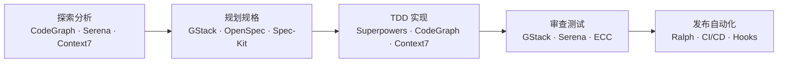

:::info {title="📊 页面导航"}
**适用角色与上手难度**

| 角色 | 推荐度 | 上手难度 |
|------|--------|----------|
| 🛠️ 开发 | ★★★★★ | ★★☆☆☆ |
| 🧪 测试 | ★★★☆☆ | ★★★☆☆ |
| 📦 产品 | ★★★☆☆ | ★★★☆☆ |

**🎯 学习产出：** 了解前端工具链集成方案，能独立搭建多工具协同的前端开发工作流

**🚀 AI 能力提升：** 跨文件重构、代码生成
:::

# 前端工具链集成全景

本系列聚焦**前端开发场景下的工具集成实践**，而非单个工具的独立介绍。如果你还不熟悉某个工具的基础用法，请先参阅 [进阶指南](/guide/advanced/superpowers) 中对应的详细文档。这里的重点是：如何将多个工具串联成一条完整的前端开发工作流，让它们在不同阶段各司其职、协同增效。

## 工具矩阵

下表列出本系列涉及的 9 个核心工具，以及它们在前端开发中的角色定位：

| 工具        | 角色     | 前端核心价值                      | 对应开发阶段  |
| ----------- | -------- | --------------------------------- | ------------- |
| Git 工作流  | 版本控制 | 分支策略、PR 管理、提交规范       | 全流程        |
| Superpowers | 开发纪律 | TDD 驱动、头脑风暴、代码审查      | 实现阶段      |
| Taste Skill | 设计品质 | 反 AI 平庸设计、Pre-Flight Check  | 实现阶段      |
| GStack      | 虚拟团队 | 内置浏览器 QA、设计审查、安全审计 | 审查/发布阶段 |
| OpenSpec    | 规格驱动 | 结构化需求文档、增量变更管理      | 规划阶段      |
| Ralph       | 自主循环 | PRD 驱动自动开发、批量任务执行    | 自动化阶段    |
| CodeGraph   | 代码图谱 | 组件依赖分析、影响范围评估        | 探索/分析阶段 |
| Context7    | 文档注入 | 最新框架文档、API 参考            | 编码阶段      |
| Serena      | 代码语义 | 符号级重构、精确重命名            | 重构阶段      |

## 五阶段工作流

前端开发可以划分为以下五个阶段，每个阶段有对应的主力工具：

每个阶段的详细操作步骤，请参阅后续子页面。

## 子页面

- [集成工作流详解](./integrated-workflow) — 五阶段工作流的逐步指南
- [场景实战指南](./scenarios) — 6 个完整实战案例

:::tip
前端通用最佳实践（代码规范、性能优化、组件设计等）请参阅 [前端最佳实践](/tips/frontend-best-practices)。本系列专注于工具链集成，两者互为补充。
:::

## 与工具详解的关系

本系列的每个工具都有对应的独立详解页面，收录在 [进阶指南](/guide/advanced/superpowers) 中。两者的定位不同：

- **进阶指南**：单个工具的安装配置、核心概念、使用方法——适合初次接触某工具时阅读
- **本系列**：多工具在前端场景中的组合策略、阶段划分、实战案例——适合搭建完整工作流时参考

以下是各工具的详解页面索引：

| 工具        | 详解页面                                                   |
| ----------- | ---------------------------------------------------------- |
| Git 工作流  | 通用实践，无独立页面                                       |
| Superpowers | [Superpowers 插件](/guide/advanced/superpowers)            |
| Taste Skill | [Taste Skill](/skills/frontend/taste)                      |
| GStack      | [Gstack 工具包](/guide/advanced/gstack)                    |
| OpenSpec    | [OpenSpec 规格驱动开发](/guide/advanced/sdd/openspec)      |
| Ralph       | [Ralph 自主循环](/guide/advanced/ralph)                    |
| CodeGraph   | [CodeGraph 代码智能](/guide/advanced/code-graph/codegraph) |
| Context7    | [Context7 实时文档](/guide/advanced/context7)              |
| Serena      | [Serena 代码语义工具](/guide/advanced/serena)              |

:::tip 下一步
了解了工具全景后，推荐按顺序阅读 [集成工作流详解](./integrated-workflow) 了解五阶段操作细节，或直接跳到 [场景实战指南](./scenarios) 通过 7 个完整案例快速上手。
:::
