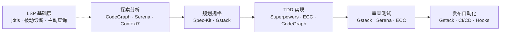

:::info {title="📊 页面导航"}
**适用角色与上手难度**

| 角色 | 推荐度 | 上手难度 |
|------|--------|----------|
| 🛠️ 开发 | ★★★★★ | ★★☆☆☆ |
| 🧪 测试 | ★★★☆☆ | ★★★☆☆ |
| 📦 产品 | ★★☆☆☆ | ★★★★☆ |

**🎯 学习产出：** 了解 Java 工具链方案，能独立搭建多工具协同的 Java/Spring Boot 开发工作流

**🚀 AI 能力提升：** 代码生成、调试诊断
:::

# Java 工具链集成全景

本系列聚焦 **Java/Spring Boot 开发场景下的工具集成实践**，而非单个工具的独立介绍。如果你还不熟悉某个工具的基础用法，请先参阅 [进阶指南](/guide/advanced/superpowers) 中对应的详细文档。这里的重点是：如何将多个工具串联成一条完整的 Java 开发工作流，让它们在不同阶段各司其职、协同增效。

:::warning
**在使用本系列的任何工具之前，请先完成 [Java LSP 配置](./lsp-setup)。** 没有 LSP，Claude Code 只能用 grep 搜索代码（30-60 秒/次，结果不精确），CodeGraph 探索和 Serena 重构都会受限于文本搜索的精度。配置 LSP 后，查询速度提升到 ~50ms 且 100% 语义准确。
:::

## 工具矩阵

下表列出本系列涉及的 9 个核心工具，以及它们在 Java 开发中的角色定位：

| 工具        | 角色         | Java 核心价值                             | 对应开发阶段  |
| ----------- | ------------ | ----------------------------------------- | ------------- |
| LSP (jdtls) | 代码语义基础 | 被动诊断 + 主动查询，Claude Code 内置能力 | 全流程        |
| ECC         | 全能增强     | Java 专属 Agent + Spring Boot Skills      | 全流程        |
| Superpowers | 开发纪律     | 强制 TDD、头脑风暴、计划驱动              | 实现阶段      |
| Gstack      | 虚拟团队     | Staff 级审查、QA、安全审计、发布          | 审查/发布阶段 |
| Spec-Kit    | 规格驱动     | 结构化规格文档、需求澄清、任务转 Issue    | 规划阶段      |
| CodeGraph   | 代码图谱     | Spring 路由识别、类依赖分析、影响评估     | 探索/分析阶段 |
| Graphify    | 多模态图谱   | 代码 + 架构文档 + 设计图的统一图谱        | 探索/分析阶段 |
| Serena      | 代码语义     | 符号级重构、JetBrains 增强、精确重命名    | 重构阶段      |
| Context7    | 文档注入     | Spring Boot 最新文档、API 参考            | 编码阶段      |

## 五阶段工作流

Java/Spring Boot 开发可以划分为以下五个阶段，每个阶段有对应的主力工具：

每个阶段的详细操作步骤，请参阅后续子页面。

## 子页面

- [集成工作流详解](./integrated-workflow) — 五阶段工作流的逐步指南
- [场景实战指南](./scenarios) — 5 个完整实战案例

### 相关页面

- [Java 自定义 Skills 参考](/tips/java-custom-skills) — 完整的 SKILL.md 示例库
- [Java LSP 配置指南](./lsp-setup) — 从 grep 搜索升级到语义理解（**强烈推荐首先配置**）

:::tip
Java 通用最佳实践（CLAUDE.md 配置、提示词策略、测试方法等）请参阅 [Java 开发最佳实践](/tips/java-best-practices)。本系列专注于工具链集成，两者互为补充。
:::

## 与工具详解的关系

本系列的每个工具都有对应的独立详解页面，收录在 [进阶指南](/guide/advanced/superpowers) 中。两者的定位不同：

- **进阶指南**：单个工具的安装配置、核心概念、使用方法——适合初次接触某工具时阅读
- **本系列**：多工具在 Java 场景中的组合策略、阶段划分、实战案例——适合搭建完整工作流时参考

以下是各工具的详解页面索引：

| 工具        | 详解页面                                                   |
| ----------- | ---------------------------------------------------------- |
| LSP (jdtls) | [Java LSP 配置指南](/tips/java-practices/lsp-setup)        |
| ECC         | [ECC 增强 Claude Code](/tips/ecc)                          |
| Superpowers | [Superpowers 插件](/guide/advanced/superpowers)            |
| Gstack      | [Gstack 工具包](/guide/advanced/gstack)                    |
| Spec-Kit    | [Spec-Kit 规格驱动开发](/guide/advanced/sdd/spec-kit)      |
| CodeGraph   | [CodeGraph 代码智能](/guide/advanced/code-graph/codegraph) |
| Graphify    | [Graphify 知识图谱](/guide/advanced/code-graph/graphify)   |
| Serena      | [Serena 代码语义工具](/guide/advanced/serena)              |
| Context7    | [Context7 实时文档](/guide/advanced/context7)              |
