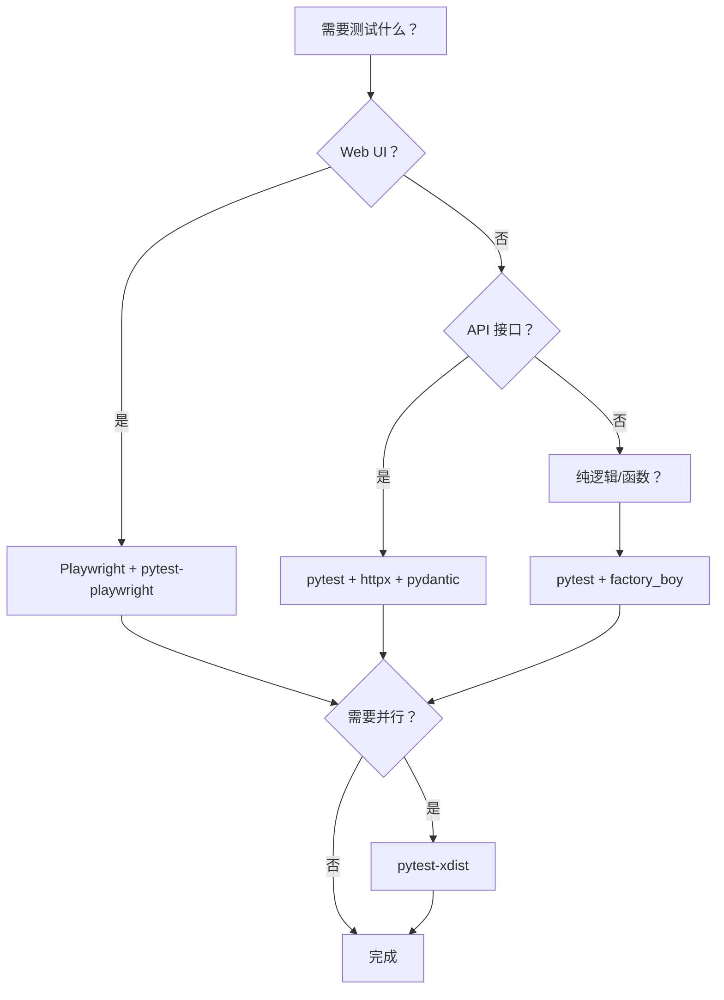

# Python 测试工具链概览

本系列聚焦 **Python Web UI 和 API 自动化测试场景下的工具实践**，而非单个工具的独立介绍。如果你还不熟悉 pytest 或 Playwright 的基础用法，请先参阅 [Python 自动化测试最佳实践](/tips/python-best-practices)。这里的重点是：如何将多个工具串联成一条完整的 Python 测试工作流，从 LSP 语义基础到测试编写、数据管理、调试排错，各阶段各司其职、协同增效。

:::warning
**在使用本系列的任何工具之前，请先完成 [Python LSP 配置](./lsp-setup)。** 没有 LSP，Claude Code 只能用 grep 搜索代码（30-60 秒/次，结果不精确）。配置 basedpyright 后，查询速度提升到 ~50ms 且 100% 语义准确。
:::

## 工具矩阵

下表列出本系列涉及的核心工具，以及它们在 Python 测试中的角色定位：

| 工具              | 角色            | Python 测试核心价值                             | 对应阶段 |
| ----------------- | --------------- | ----------------------------------------------- | -------- |
| pytest            | 测试框架        | 单元/集成/API/UI 测试的统一运行器               | 全流程   |
| Playwright        | 浏览器自动化    | Web UI E2E 测试，多浏览器支持                   | UI 测试  |
| httpx             | HTTP 客户端     | API 接口测试，async 支持，现代替代 requests     | API 测试 |
| basedpyright      | Python LSP      | 代码导航 + 即时诊断，Claude Code 语义基础       | 全流程   |
| factory_boy       | 测试数据工厂    | 测试数据生成，支持 Django ORM / SQLAlchemy      | 数据准备 |
| pydantic          | 数据验证        | JSON Schema 响应校验、配置管理、数据模型        | API 断言 |
| pytest-xdist      | 并行执行        | 多进程并行运行测试，缩短 CI 耗时                | 执行加速 |
| pytest-playwright | Playwright 集成 | 为 pytest 提供 `page`、`browser` 等内置 fixture | UI 测试  |

## 工具选型决策

从测试类型出发选择工具组合：

## 与 Claude Code 工具链的配合

Python 测试工具链可以与 Claude Code 生态中的通用工具协同，进一步提升效率：

| Claude Code 工具   | 在 Python 测试中的角色 | 典型场景                            |
| ------------------ | ---------------------- | ----------------------------------- |
| LSP (basedpyright) | 代码语义基础           | fixture 跳转、类型检查、重构安全网  |
| CodeGraph          | Python 项目探索        | 快速理解测试目录结构、依赖关系      |
| Serena             | 精确重构               | 重命名 fixture、提取测试工具函数    |
| ECC                | Python Agent 增强      | python-reviewer、python-testing     |
| Gstack             | 代码审查 + QA          | 审查测试代码质量、在浏览器中验证 UI |

## 子页面

- [Python LSP 配置指南](./lsp-setup) — basedpyright 安装、配置、验证
- [Page Object Model 深度实践](./playwright-pom) — 多页面电商系统的完整 PO 实现
- [API 测试架构模式](./api-testing-patterns) — 测试分层、响应验证、认证管理、资源清理
- [真实场景实战案例](./scenarios) — 3 个完整实战案例（UI E2E、API CRUD、混合测试）

### 相关页面

- [Python 自动化测试最佳实践](/tips/python-best-practices) — 从环境搭建到调试排错的完整指南
- [前端开发最佳实践](/tips/frontend-best-practices) — Playwright E2E 在前端项目中的用法
- [React 开发最佳实践](/tips/react-best-practices) — Playwright 组件测试
- [Vue 开发最佳实践](/tips/vue-best-practices) — Playwright + Vue 集成

:::tip
本系列专注于 Python 测试工具链的深度集成。入门和基础用法（pytest fixture、Playwright 第一个用例、提示词模板等）请参阅 [Python 自动化测试最佳实践](/tips/python-best-practices)。两者互为补充。
:::
